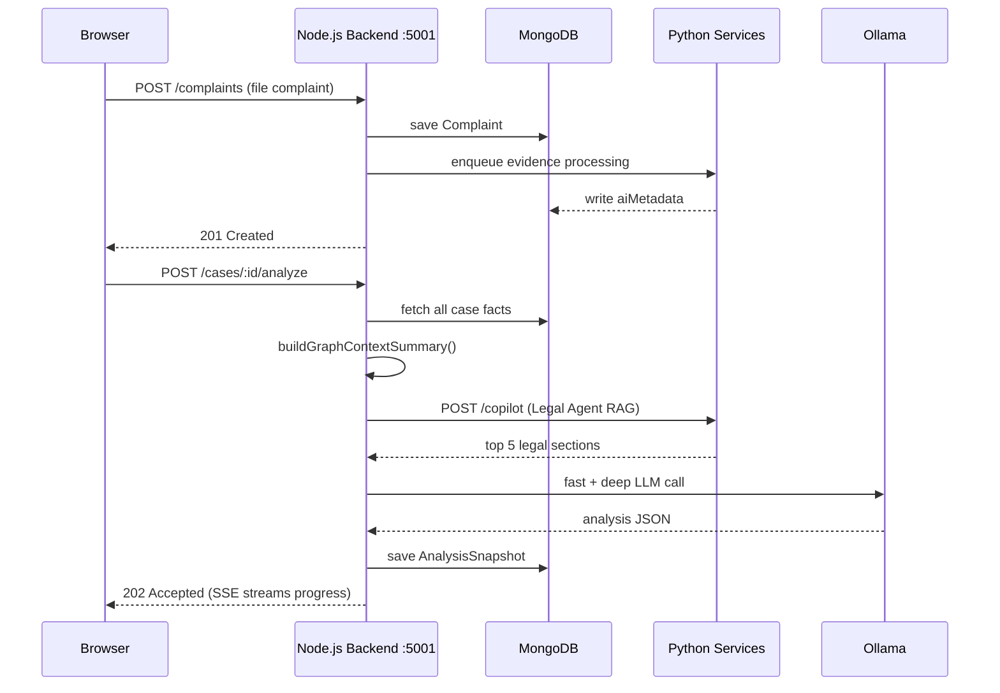
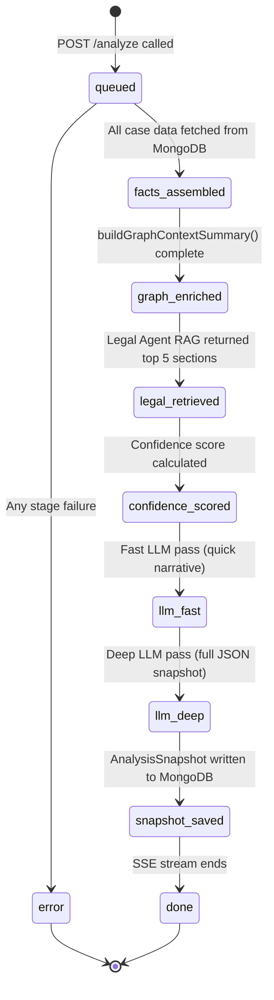
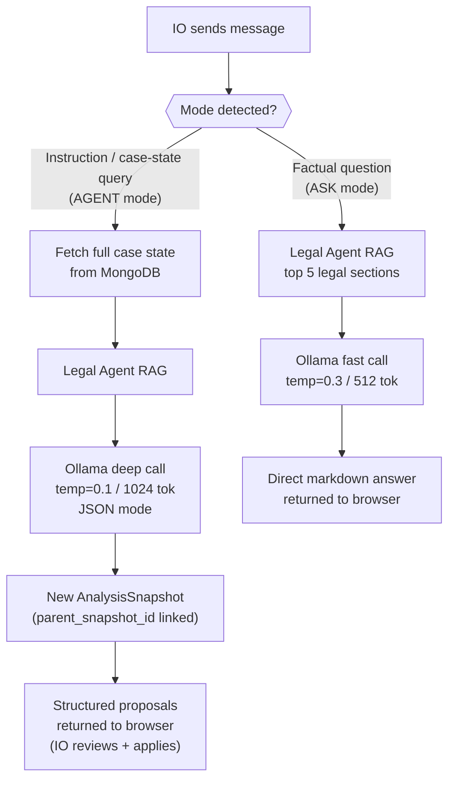
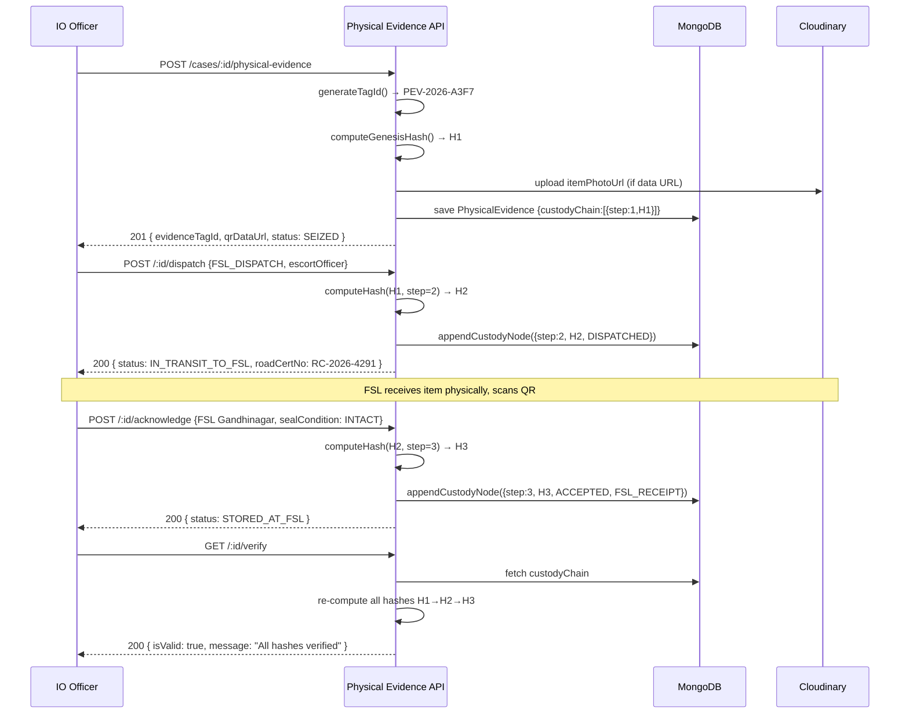
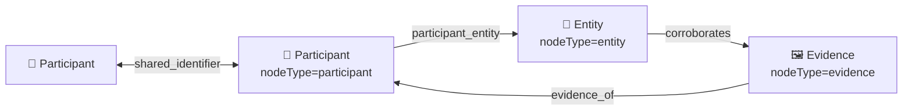
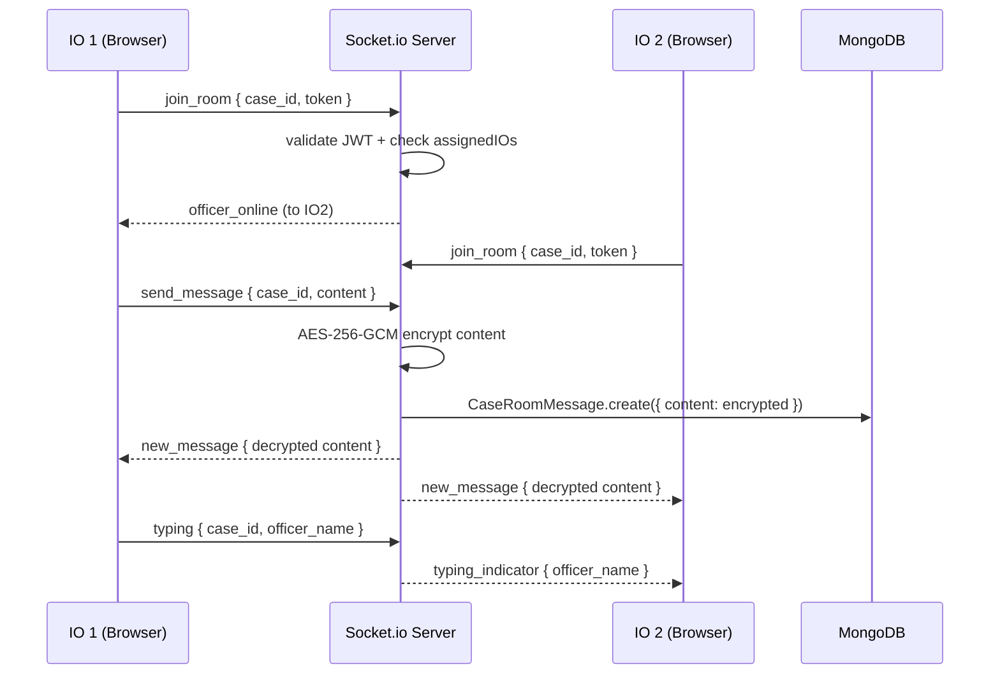

# Crime OS — API Documentation

> Complete reference for all REST API endpoints exposed by the Crime OS backend.  
> **Base URL:** `http://localhost:5001/api/v1`  
> **Auth:** JWT access token in `Authorization: Bearer <token>` header (where required).  
> **Roles:** `ADMIN` · `SHO` (Station House Officer) · `IO` (Investigating Officer) · `USER` (citizen — unused in current flow, kept for reference)

Endpoints are ordered to follow the natural flow of data through the platform: from system health → admin setup → officer login → complaint filing → SHO review → IO investigation → case closure.

---

## Table of Contents

1. [Health Check](#1-health-check)
2. [Admin — Setup & Management](#2-admin--setup--management)
   - [Admin Auth](#admin-auth)
   - [Police Stations](#police-stations)
   - [Officers](#officers)
   - [Department Registry](#department-registry)
3. [Officer Auth](#3-officer-auth)
4. [Complaint Filing](#4-complaint-filing)
5. [SHO Actions](#5-sho-actions)
6. [Investigation — AI Analysis](#6-investigation--ai-analysis)
7. [Investigation — Copilot](#7-investigation--copilot)
8. [Investigation — Checklist](#8-investigation--checklist)
9. [Investigation — Department Requests & Threads](#9-investigation--department-requests--threads)
10. [Investigation — Citizen Requests](#10-investigation--citizen-requests)
11. [Citizen Request Portal (Token-based, No Auth)](#11-citizen-request-portal-token-based-no-auth)
12. [Investigation — Case Participants](#12-investigation--case-participants)
13. [Investigation — Evidence](#13-investigation--evidence)
14. [Investigation — Physical Evidence](#14-investigation--physical-evidence)
15. [Investigation — Knowledge Graph](#15-investigation--knowledge-graph)
16. [Investigation — Case Diary](#16-investigation--case-diary)
17. [Investigation — Escalation](#17-investigation--escalation)
18. [Charge Sheet](#18-charge-sheet)
19. [Case Closure & IO Recommendation](#19-case-closure--io-recommendation)
20. [Case Understanding](#20-case-understanding)
21. [Translation](#21-translation)
22. [Private Case Room (Multiple IO Collaboration)](#22-private-case-room-multiple-io-collaboration)
23. [Prompt Compression Service](#23-prompt-compression-service)

---

## Request/Response Flow Overview



---

## 1. Health Check

| Method | Path | Auth |
|--------|------|------|
| `GET` | `/health` | None |

Returns the API liveness status, current timestamp, and environment. Used by monitoring and the `start_all.bat` startup script.

---

## 2. Admin — Setup & Management

> All admin endpoints require `ADMIN` role.  
> Admin accounts cannot manage investigation data — they are strictly for platform setup.

### Admin Auth

| Method | Path | Auth | Description |
|--------|------|------|-------------|
| `POST` | `/admin/login` | None | Logs in the admin with username + password. Returns JWT access token and sets a refresh token cookie. |
| `GET` | `/admin/me` | ADMIN | Returns the current admin's profile. |
| `POST` | `/admin/logout` | ADMIN | Invalidates the admin refresh token from Redis and clears the cookie. |

---

### Police Stations

CRUD operations for managing police stations in the system.

| Method | Path | Description |
|--------|------|-------------|
| `POST` | `/admin/police-stations` | Creates a new police station. Validates `code` uniqueness. Body: `name`, `code`, `address`, `city`, `district`, `pincode`, `phone?`, `email?`. |
| `GET` | `/admin/police-stations` | Lists all police stations, sorted by creation date. |
| `GET` | `/admin/police-stations/:id` | Fetches a single police station by its MongoDB `_id`. |
| `PUT` | `/admin/police-stations/:id` | Updates a police station's details. All fields editable except `code`. |
| `DELETE` | `/admin/police-stations/:id` | Deletes a station. Blocked if any officers are still assigned to it. |

---

### Officers

CRUD operations for SHO and IO accounts. Officers cannot self-register.

| Method | Path | Description |
|--------|------|-------------|
| `POST` | `/admin/officers` | Creates a new police officer. Hashes password, validates station, checks email and badge uniqueness. Body: `name`, `email`, `badgeNumber`, `password`, `role` (`SHO`/`IO`), `policeStation` (ObjectId), `phone?`. |
| `GET` | `/admin/officers` | Lists all officers with station populated. |
| `GET` | `/admin/officers/:id` | Fetches a single officer with station details. |
| `PUT` | `/admin/officers/:id` | Updates officer details. Password re-hashed if provided. |
| `DELETE` | `/admin/officers/:id` | Hard-deletes an officer record. |

---

### Department Registry

Manages the registry of external departments (forensic labs, banks, telecom providers, courts, etc.) that the IO can send requests to. Each active department is also embedded into the Qdrant vector database so the AI and Legal Agent can retrieve them during RAG.

| Method | Path | Description |
|--------|------|-------------|
| `GET` | `/admin/departments` | Lists all registered departments (both active and inactive). |
| `POST` | `/admin/departments` | Creates a new department entry and **simultaneously embeds it into Qdrant**. Body: `entity_id`, `entity_name`, `category`, `contact_email?`, `what_they_can_provide` (array), `legal_basis_typically_cited` (array), `typical_response_time`, `confidence`, `escalation_path_if_no_response`, `notes_or_caveats`. |
| `PUT` | `/admin/departments/:id` | Updates a department and **re-embeds** its updated vector into Qdrant. |
| `PATCH` | `/admin/departments/:id/deactivate` | Soft-deactivates (`isActive: false`) and **removes vector from Qdrant**. |
| `PATCH` | `/admin/departments/:id/activate` | Re-activates and **re-inserts vector into Qdrant**. |

---

## 3. Officer Auth

| Method | Path | Auth | Description |
|--------|------|------|-------------|
| `POST` | `/police/login` | None (rate-limited) | Officer login using email + password. Issues JWT access token + refresh cookie. Body: `email`, `password`. |
| `GET` | `/police/me` | SHO or IO | Returns the currently authenticated officer's full profile. |
| `POST` | `/police/logout` | SHO or IO | Invalidates refresh token from Redis, clears cookie. |

---

## 4. Complaint Filing

> Complaints are filed by officers (SHO or IO) on behalf of complainants.

| Method | Path | Auth | Description |
|--------|------|------|-------------|
| `GET` | `/complaints/police-stations/search` | Authenticated | Searches police stations by name or code. Query: `?q=<search_term>`. |
| `POST` | `/complaints/multimodal-intake` | SHO or IO | AI-powered pre-filing analysis. Accepts complaint text and/or uploaded files (images, audio, PDF, video). Returns structured analysis profile — entities, category suggestion, missing information. Body: `text?`, `files[]` (multipart). |
| `POST` | `/complaints/upload-signature` | SHO or IO | Returns a Cloudinary signed upload URL so the browser can upload evidence files **directly to CDN**. Query: `?caseId=<id>` (optional). |
| `POST` | `/complaints` | SHO or IO | **Files the complaint officially.** Creates the complaint record (status: `SUBMITTED`) and triggers the background AI pipeline asynchronously. Body: `title`, `description`, `category`, `policeStation`, `incidentDate`, `incidentPlace`, `evidence?[]`, `location?`. |
| `GET` | `/complaints/station/list` | SHO or IO | Lists all complaints at the officer's station. Query: `?status=`, `?search=`, `?page=`, `?limit=`. |
| `GET` | `/complaints/:id` | SHO or IO | Fetches a single complaint by `_id` with full detail including evidence and current status. |
| `POST` | `/complaints/:id/evidence` | SHO or IO | Adds a digital evidence item (already uploaded to Cloudinary) to a complaint. Body: `{ type, url, description, cloudinaryPublicId, ... }`. |
| `POST` | `/complaints/:id/physical-evidence` | IO | Adds a lightweight physical evidence reference to a complaint. Body: `{ name, description, currentLocation?, custodyDetails? }`. |

---

## 5. SHO Actions

| Method | Path | Auth | Description |
|--------|------|------|-------------|
| `GET` | `/complaints/police/ios` | SHO | Lists IO officers at the caller's station — ranked by AI-computed `recommendationScore` (0–100) and `reasons[]` from the IO Recommendation service. |
| `PATCH` | `/complaints/:id/approve` | SHO | Approves a complaint, assigns it to an IO. Updates status to `ASSIGNED_TO_IO`, creates initial case checklist. Body: `{ assignedIO: <officerId> }`. |
| `PATCH` | `/complaints/:id/reject` | SHO | Rejects complaint with written reason. Enqueues rejection email to complainant. Body: `{ rejectionReason: string }`. |
| `POST` | `/complaints/:id/fir/prepare` | SHO | Fetches pre-assembled FIR form data from complaint — all fields pre-populated from case data. |
| `PATCH` | `/complaints/:id/register-fir` | SHO | **Officially registers the FIR.** Updates status to `FIR_REGISTERED`, assigns FIR number, enqueues PDF generation (English + bilingual Gujarati-English). Body: `{ firFormData?: { ... } }`. |
| `PATCH` | `/complaints/:id/close` | SHO or IO | Closes a case (status: `CLOSED`). Triggers IO Recommendation vector embedding. |

---

## 6. Investigation — AI Analysis

> All require SHO or IO auth.

| Method | Path | Description |
|--------|------|-------------|
| `POST` | `/cases/:id/analyze` | **Triggers a full AI analysis run.** Returns `202 Accepted` immediately — the orchestrator assembles case facts, queries the Knowledge Graph (`buildGraphContextSummary()`), calls the Legal Agent RAG, calculates confidence score, runs fast + deep LLM passes, saves an `AnalysisSnapshot`. Body: `{ language?: "en"/"hi"/"gu" }`. |
| `GET` | `/cases/:id/analysis/status` | **State-recovery endpoint.** Returns the current progress stage from Redis (`"idle"`, `"queued"`, `"facts_assembled"`, `"legal_retrieved"`, etc.). Frontend calls this on page load before opening the SSE connection. |
| `GET` | `/cases/:id/analysis/progress` | **SSE (Server-Sent Events) stream.** Opens a persistent connection and streams real-time analysis stage progress events from Redis pub/sub. Each event: `{ stage, message, progress }`. Sends a keepalive comment every 20 seconds. Auto-closes on `done` or `error`. |
| `GET` | `/cases/:id/analysis/latest` | Returns the most recently created `AnalysisSnapshot` — including narrative summary, confidence breakdown, suggested legal sections, participant recommendations, and next steps. |
| `GET` | `/cases/:id/analysis/:snapshotId` | Returns a specific historical `AnalysisSnapshot` by ID. |
| `POST` | `/cases/:id/analysis/:snapshotId/correct` | **Officer correction of an AI snapshot.** IO provides a correction message. Orchestrator runs a targeted LLM correction pass, creates a new snapshot linked via `parent_snapshot_id`. Body: `{ correction_message: string }`. |
| `POST` | `/cases/:id/analysis/manual` | **Creates a fully manual snapshot** without LLM involvement. Body: `{ narrative_summary, ranked_next_steps?: [], suspect_candidates?: [], suggested_legal_sections?: [] }`. |

Analysis progress stages (SSE stream):



---

## 7. Investigation — Copilot

| Method | Path | Description |
|--------|------|-------------|
| `POST` | `/cases/:id/copilot/ask` | **Sends a message to the AI Copilot.** The copilot first queries the Legal Agent RAG to retrieve relevant BNS/BNSS/BSA/SOP sections. In **ASK mode** (factual questions), returns a direct markdown answer. In **AGENT mode** (instructions or case-state queries), fetches the full live case state from MongoDB, re-runs the analysis pipeline, and returns a structured **proposal** (e.g., `add_step`, `draft_request`) which the officer must explicitly apply. Body: `{ message: string, language?: string }`. |

Copilot mode decision flow:



---

## 8. Investigation — Checklist

| Method | Path | Description |
|--------|------|-------------|
| `GET` | `/cases/:id/checklist` | Returns the full investigation checklist: all steps with status, criticality, required evidence, type. |
| `POST` | `/cases/:id/checklist/steps` | Manually adds a new step. Also used when IO applies a Copilot-suggested step. Body: `{ title, description?, criticality? }`. |
| `POST` | `/cases/:id/checklist/:stepId/complete` | Marks a specific checklist step as completed. |

---

## 9. Investigation — Department Requests & Threads

### Request Composer

| Method | Path | Description |
|--------|------|-------------|
| `GET` | `/cases/departments` | Lists all active departments from the registry for the request-composer dropdown. |
| `POST` | `/cases/:id/requests/draft` | **AI-generates a formal department request letter.** Calls Legal Agent for BNSS citations, then Ollama (deep call) to write the complete formal letter. Body: `{ step_id, department_entity_id, request_type?, recipient_type? }`. |
| `PATCH` | `/cases/:id/requests/:reqId` | Updates an editable request draft (only while status is `draft` or `reviewed`). |
| `POST` | `/cases/:id/requests/:reqId/send` | **Finalizes and sends.** Locks the linked checklist step as `blocked`, enqueues email via BullMQ. |
| `GET` | `/cases/:id/requests` | Lists all department requests filed for the case. |

### Request Threads

| Method | Path | Description |
|--------|------|-------------|
| `GET` | `/cases/:id/threads` | Lists all request threads for the case (both department and citizen threads). |
| `GET` | `/cases/threads/:threadId` | Fetches a single thread with full message history. |
| `POST` | `/cases/threads/:threadId/reply` | IO posts a reply. Body: `{ content: string, attachments?: [] }`. |
| `POST` | `/cases/threads/:threadId/format-response` | Passes the latest response text through Ollama to rewrite in formal official language. |
| `POST` | `/cases/:id/threads/:thread_id/export-pdf` | Exports the complete thread to a PDF, uploads to Cloudinary, returns PDF URL. |

---

## 10. Investigation — Citizen Requests

| Method | Path | Description |
|--------|------|-------------|
| `POST` | `/cases/:id/citizen-request` | **IO requests additional evidence from the complainant**, tied to a specific checklist step. Creates a `RequestThread`, marks the step as `blocked`, generates a one-time secure token, enqueues email to complainant. Body: `{ step_id }`. |
| `POST` | `/cases/:id/citizen-request/missing-info` | **IO requests information identified as missing by AI analysis** (not tied to a step). Body: `{ item, reason?, importance?, type? }`. |

---

## 11. Citizen Request Portal (Token-based, No Auth)

> **Public endpoints** — no JWT required. The complainant accesses these via a unique one-time token link sent to their email by the IO.

| Method | Path | Description |
|--------|------|-------------|
| `GET` | `/citizen-request/:token` | Validates the token and returns the request details — case reference number, what is being requested, status, and expiry. Used to render the citizen-facing response page. |
| `POST` | `/citizen-request/:token/response` | **Citizen submits their response.** Accepts a text message and/or file uploads (images, audio, PDF, video — max 50MB each). Creates evidence records in MongoDB, marks the request as `response_received`, unblocks the linked checklist step, asynchronously triggers the Python AI pipeline to process any uploaded files. Body: `message?` (text), `files[]` (multipart). |

---

## 12. Investigation — Case Participants

| Method | Path | Description |
|--------|------|-------------|
| `GET` | `/cases/:id/participants` | Lists all participants linked to the case. |
| `POST` | `/cases/:id/participants` | Manually creates a new participant. Body: `{ name, roles: [...], contact?, identifiers?[], victimProfile?, witnessProfile?, suspectProfile?, complainantProfile? }`. |
| `POST` | `/cases/:id/participants/recommendations/approve` | **Approves an AI-recommended participant** from the latest `AnalysisSnapshot`. Body: `{ recommendation, snapshot_id?, contact?, ...profile fields }`. |
| `PATCH` | `/cases/:id/participants/:participantId` | Updates a participant's details. |
| `DELETE` | `/cases/:id/participants/:participantId` | Removes a participant from the case. |
| `PATCH` | `/cases/:id/participants/:participantId/promote-to-accused` | **Promotes a Suspect to Accused** — updates role and marks `isAccused: true`. |
| `POST` | `/cases/:id/participants/:participantId/sections/attach` | Attaches BNS/BNSS legal sections to a participant. Body: `{ sections: [{ code, title, reason? }] }`. |
| `POST` | `/cases/:id/participants/:participantId/statements` | Records a formal statement. Body: `{ content: string, recordedAt: ISO date string }`. |
| `DELETE` | `/cases/:id/participants/:participantId/statements/:statementId` | Deletes a specific statement record. |
| `POST` | `/cases/:id/participants/:participantId/statements/transcribe` | **Audio-to-text transcription.** Accepts a multipart audio file, sends it to `faster-whisper`, returns transcript + detected language + English translation. Audio is **never stored**. Body: `file` (multipart, max 50MB). |
| `POST` | `/cases/:id/participants/:participantId/identifiers/upload-signature` | Returns a Cloudinary signed upload signature for an identifier document. |
| `POST` | `/cases/:id/participants/:participantId/reasoning` | Adds an investigative reasoning note. Body: `{ content: string, source?: "officer"/"ai" }`. |
| `PATCH` | `/cases/:id/participants/:participantId/reasoning/:reasoningId` | Updates an existing reasoning note. Body: `{ content: string }`. |
| `DELETE` | `/cases/:id/participants/:participantId/reasoning/:reasoningId` | Deletes a reasoning note. |

---

## 13. Investigation — Evidence

| Method | Path | Description |
|--------|------|-------------|
| `GET` | `/cases/:id/evidence` | Fetches all evidence items — including AI-extracted metadata (OCR text, speech transcripts, object tags, GPS data, AI summary, deepfake confidence score, processing status). |
| `POST` | `/cases/:id/evidence` | Adds a new evidence item. Body: `{ type, url/storage_ref, description, cloudinaryPublicId?, ... }`. |
| `POST` | `/cases/:id/evidence/:evidenceId/sections/attach` | Attaches AI-suggested BSA legal sections to a specific evidence item. Body: `{ sections: [{ code, title, reason? }] }`. |
| `POST` | `/cases/:id/evidence/:evidenceId/transfer` | Transfers an evidence item to another police station. Logs the transfer in the custody chain, sends a notification email. Body: `{ targetStationEmail?, manualStationName?, ioChecklistStepId? }`. |

---

## 14. Investigation — Physical Evidence

> All endpoints require SHO or IO auth.  
> Physical evidence items have a cryptographic SHA-256 custody chain to prevent tampering.  
> **Base prefix:** `/api/v1/physical-evidence`



### Create Physical Evidence

`POST /api/v1/physical-evidence/cases/:id/physical-evidence`

Registers a newly seized physical item. Generates a unique `evidenceTagId`, a QR code (pointing to the public verification URL), and computes the Genesis hash (step 1 of the custody chain).

**Request Body**
```json
{
  "itemName": "Glock 19 Handgun",
  "category": "WEAPON",
  "description": "9mm handgun found at crime scene, serial number filed off",
  "quantityOrWeight": "1 unit",
  "conditionOnSeizure": "Loaded, safety off, one round chambered",
  "seizureMemoNo": "SM-2026-9092",
  "seizedByOfficer": {
    "id": "officer_id_here",
    "name": "IO Ravi Sharma",
    "badge": "GJ-IO-4421",
    "station": "Ahmedabad East PS"
  },
  "seizureDate": "2026-08-16T10:30:00Z",
  "seizureLocation": "Behind SBI Bank, Satellite Road, Ahmedabad",
  "witnesses": [
    { "name": "Suresh Patel", "contact": "9876543210", "address": "Flat 3, Satellite Apts" }
  ],
  "sealNumber": "S-99120",
  "itemPhotoUrl": "https://cdn.cloudinary.com/...",
  "policeStationId": "PS-AHM-EAST-01",
  "malkhanaRegisterNo": "MR-2026-0041"
}
```

**Response (201 Created)**
```json
{
  "status": "success",
  "message": "Physical Evidence logged successfully",
  "data": {
    "evidenceTagId": "PEV-2026-A3F7B1",
    "status": "SEIZED",
    "qrDataUrl": "data:image/png;base64,...",
    "custodyChain": [
      {
        "step": 1,
        "transferAction": "INITIAL_SEIZURE",
        "currentHash": "a4e9f1b2c3...",
        "transferStatus": "ACCEPTED"
      }
    ]
  }
}
```

---

### Get Physical Evidence by Case

`GET /api/v1/physical-evidence/cases/:id/physical-evidence`

Returns all physical items linked to a specific case. Includes the full custody chain, QR data URL, current custodian, and seal status for each item.

---

### Get Physical Evidence by Tag ID

`GET /api/v1/physical-evidence/tag/:tagId`

Fetches a single physical evidence record by its unique tag ID (e.g. `PEV-2026-A3F7B1`). Used when scanning the QR code printed on the physical seal.

---

### Get Physical Evidence by MongoDB ID

`GET /api/v1/physical-evidence/:id`

Fetches a single physical evidence record by its MongoDB `_id`.

---

### Initiate Dispatch

`POST /api/v1/physical-evidence/:id/dispatch`

Initiates a custody transfer — from IO to Malkhana, Malkhana to FSL, or any other destination. Computes the next SHA-256 hash in the chain and marks the item as `IN_TRANSIT_*`. Returns `400` if the item is already in transit.

**Request Body**
```json
{
  "transferAction": "FSL_DISPATCH",
  "destinationName": "State Forensic Science Laboratory, Gandhinagar",
  "escortOfficer": {
    "id": "escort_officer_id",
    "name": "Constable Mehul Shah",
    "badge": "GJ-PC-7711"
  },
  "roadCertificateNo": "RC-2026-4291",
  "remarks": "Dispatched for ballistic analysis"
}
```

**Response (200)**
```json
{
  "status": "success",
  "data": {
    "status": "IN_TRANSIT_TO_FSL",
    "currentCustodian": {
      "holderName": "Constable Mehul Shah (Escort Officer)",
      "location": "In Transit -> State FSL Gandhinagar (RC #RC-2026-4291)"
    },
    "custodyChain": [ "...all nodes including new DISPATCHED node..." ]
  }
}
```

**`transferAction` values and resulting `status`:**

| `transferAction` | Resulting Status |
|------------------|-----------------|
| `FSL_DISPATCH` | `IN_TRANSIT_TO_FSL` |
| `COURT_PRODUCTION` | `IN_TRANSIT_TO_COURT` |
| `STATION_TRANSFER` | `IN_TRANSIT_TO_FACILITY` |
| `HOSPITAL_MEDICAL_DISPATCH` | `IN_TRANSIT_TO_FACILITY` |
| `FACILITY_DISPATCH` | `IN_TRANSIT_TO_FACILITY` |
| `RELEASE_TO_OWNER` | `RELEASED_TO_OWNER` |

---

### Acknowledge Receipt

`POST /api/v1/physical-evidence/:id/acknowledge`

Receiving officer accepts the item, verifies the seal, and completes the cryptographic custody node. Returns `400` if the item is not currently in transit. The service infers the correct `transferAction` from the `receiptLocation` string (checks for keywords: `fsl`, `forensic`, `court`, `malkhana`, `police`, `hospital`, `medical`).

**Request Body**
```json
{
  "receivedByOfficer": {
    "id": "fsl_officer_id",
    "name": "Dr. Priya Mehta",
    "badge": "FSL-SCI-0042",
    "station": "State FSL Gandhinagar"
  },
  "receiptLocation": "State Forensic Science Laboratory, Gandhinagar",
  "fslLabEntryNo": "FSL-2026-00881",
  "sealCondition": "INTACT",
  "remarks": "Received in good condition. Seal intact. Lab entry registered."
}
```

**Response (200)**
```json
{
  "status": "success",
  "data": {
    "status": "STORED_AT_FSL",
    "custodyChain": [ "...all nodes including new FSL_RECEIPT ACCEPTED node..." ]
  }
}
```

---

### Verify Chain Integrity

`GET /api/v1/physical-evidence/:id/verify`

Recalculates every SHA-256 hash in the custody chain from scratch and verifies the `previousHash` continuity. Proves mathematically that no node in the chain has been tampered with.

**Response (200) — Chain intact**
```json
{
  "status": "success",
  "data": {
    "isValid": true,
    "message": "All custody chain SHA-256 hashes are 100% verified & intact."
  }
}
```

**Response (200) — Chain broken**
```json
{
  "status": "success",
  "data": {
    "isValid": false,
    "brokenStep": 2,
    "message": "Chain broken at step 2: currentHash validation failed! Expected a4e9f1..., got 00000000..."
  }
}
```

---

## 15. Investigation — Knowledge Graph

> Requires SHO or IO auth.  
> The graph is assembled dynamically on demand — no pre-built graph is stored in the database.  
> The same graph data is also used internally by the Investigation Orchestrator to enrich the LLM's analysis prompt.

### Get Case Knowledge Graph

`GET /api/v1/cases/:id/graph`

Dynamically builds the entity-participant-evidence graph for the case. Queries `CaseParticipant`, `CaseEntity`, and `Evidence` in parallel, creates typed nodes for each, and infers four types of edges. The result is returned directly to the frontend for visualization (the `CaseCorkboard` component) and is also cached in the PWA's offline IndexedDB store.

**Response (200)**
```json
{
  "status": "success",
  "data": {
    "nodes": [
      {
        "id": "60d5ec49f1e8c500...",
        "label": "Rakesh Verma",
        "nodeType": "participant",
        "meta": {
          "roles": ["Suspect"],
          "identifiers": [
            { "type": "phone", "value": "9876543210" }
          ]
        }
      },
      {
        "id": "70e6fd50g2f9d611...",
        "label": "phone: 9876543210",
        "nodeType": "entity",
        "meta": {
          "entity_type": "phone",
          "value": "9876543210",
          "corroborating_evidence_ids": ["ev-uuid-1", "ev-uuid-2"]
        }
      },
      {
        "id": "80f7ge61h3g0e722...",
        "label": "Evidence [image]",
        "nodeType": "evidence",
        "meta": {
          "type": "image",
          "status": "verified",
          "evidence_id": "ev-uuid-1"
        }
      }
    ],
    "edges": [
      {
        "from": "60d5ec49f1e8c500...",
        "to": "70e6fd50g2f9d611...",
        "relationship": "participant_entity",
        "meta": { "matchedValue": "9876543210" }
      },
      {
        "from": "70e6fd50g2f9d611...",
        "to": "80f7ge61h3g0e722...",
        "relationship": "corroborates"
      }
    ]
  }
}
```

**Node types:**

| `nodeType` | Source | Label |
|------------|--------|-------|
| `participant` | `CaseParticipant` | Person's name |
| `entity` | `CaseEntity` | `{entity_type}: {value}` |
| `evidence` | `Evidence` | `Evidence [{type}]` |

**Edge types:**

| `relationship` | Direction | Meaning |
|----------------|-----------|---------|
| `corroborates` | entity → evidence | Entity value appears in this evidence |
| `evidence_of` | evidence → participant | Evidence is linked to this participant |
| `shared_identifier` | participant ↔ participant | Two participants share the same identifier value |
| `participant_entity` | participant → entity | Participant identifier matches entity value |



---

## 16. Investigation — Case Diary

| Method | Path | Description |
|--------|------|-------------|
| `GET` | `/cases/:id/diary` | Fetches all chronological `DiaryEntry` auto-log records (every platform action logged). Sorted newest first. |
| `GET` | `/cases/:id/diary/history` | Fetches all **finalized** `CaseDiary` documents — official Roznamcha records with PDF download links. |
| `GET` | `/cases/:id/diary/places` | Returns all places visited during the investigation that have been recorded. |
| `POST` | `/cases/:id/diary/draft` | **AI-generates a new diary draft.** Calls Ollama (gemma4:e2b) with full case context to write a bilingual Roznamcha narrative. Body: `{ diary_date (required), language?, draftLanguage?, title?, officerId?, crimeRegisterNumber?, ... }`. |
| `PUT` | `/cases/:id/diary/draft/:diaryId` | Updates an editable diary draft before finalization. |
| `POST` | `/cases/:id/diary/finalize` | **Finalizes a diary draft.** Marks as complete, records `places_visited`, enqueues **PDF generation** via BullMQ for English and Gujarati-English variants. Body: `{ diary_id (required), places_visited?: [], ... }`. |
| `POST` | `/cases/:id/diary/places` | Manually records a location visited. Body: `{ address, coordinates?, visitDate, startTime?, endTime?, whatWasDone }`. |
| `POST` | `/cases/:id/diary/witnesses` | Records a witness — creates a `CaseParticipant` with Witness role and logs the statement. Body: `{ name, contact?, statement, evidenceIds?: [] }`. |

---

## 17. Investigation — Escalation

| Method | Path | Description |
|--------|------|-------------|
| `POST` | `/cases/:id/escalate` | **Manually escalates a case.** Assembles case facts, uses Ollama (fast call) to draft a 2–3 sentence escalation summary, creates an `Escalation` record (status: `pending`), logs a diary entry, and enqueues an email to the SHO. Deduplicates — will not create a new escalation if an unresolved one already exists. Body: `{ reason: string }`. |

---

## 18. Charge Sheet

| Method | Path | Auth | Description |
|--------|------|------|-------------|
| `GET` | `/cases/:id/chargesheet` | SHO or IO | Fetches the current charge sheet document — assembled from all accused participants, evidence, department request outcomes, diary entries, and AI-generated narratives. |
| `POST` | `/cases/:id/chargesheet/regenerate` | SHO or IO | **Re-generates the charge sheet using the LLM.** Calls Ollama (deep call, JSON mode) to rewrite the four narrative sections: `briefCaseDescription`, `investigationSummary`, `investigationFindings`, `finalReport`. Overwrites the existing charge sheet. |
| `GET` | `/cases/:id/chargesheet/pdf` | SHO or IO | **Streams the charge sheet as a downloadable PDF** directly in the HTTP response. Generated on-demand by PDFKit, including all case metadata, participants, evidence, legal sections, and Cloudinary links to source documents in the annexures. |

---

## 19. Case Closure & IO Recommendation

| Method | Path | Auth | Description |
|--------|------|------|-------------|
| `PATCH` | `/complaints/:id/close` | SHO or IO | Closes the case (status: `CLOSED`). After marking the case closed, the backend **fire-and-forgets** a call to the IO Recommendation service. The service embeds the complete case summary via `nomic-embed-text-v2-moe` and upserts the vector into Qdrant. This vector is later used to recommend the most suitable IO for new similar cases. |

---

## 20. Case Understanding

| Method | Path | Auth | Description |
|--------|------|------|-------------|
| `GET` | `/case-understanding/:id` | SHO or IO | Returns the full **9-section Case Understanding** document for a complaint — category, summary, entities, timeline, missing information, recommended evidence, evidence analysis, and crime analysis. Populated by the Python Complaint Intelligence pipeline. The `:id` can be either the MongoDB `_id` or the `complaintNumber` string. |

---

## 21. Translation

| Method | Path | Auth | Description |
|--------|------|------|-------------|
| `POST` | `/translation/batch` | Authenticated | **Translates a batch of UI text strings.** Sends the array to Ollama (gemma4:e2b, JSON mode) for translation. Results are cached in Redis — first call for any page/language combination triggers the LLM; subsequent calls are served from cache. Max 100 strings per request, max 2000 characters each. Body: `{ texts: string[], sourceLanguage: "en"/"hi"/"gu", targetLanguage: "en"/"hi"/"gu" }`. Returns `{ translations: string[] }`. |

---

## 22. Private Case Room (Multiple IO Collaboration)

> Requires SHO or IO auth. Room becomes available only when a case has **≥ 2 assigned IOs**.  
> All messages are stored **AES-256-GCM encrypted** in MongoDB and decrypted transparently on retrieval.  
> Real-time delivery uses **Socket.io** WebSocket connections authenticated via JWT.

### REST Endpoints

| Method | Path | Auth | Description |
|--------|------|------|-------------|
| `GET` | `/cases/:id/room/eligibility` | SHO or IO | Checks whether the case room is available. Returns `{ eligible: boolean, ioCount: number }`. |
| `GET` | `/cases/:id/room/messages` | SHO or IO | Fetches **paginated message history** (messages are decrypted before being returned). Query: `?page=<n>&limit=<n>` (default: page 1, 50 messages per page). |
| `POST` | `/cases/:id/room/messages` | SHO or IO | **Sends a message.** Encrypted with AES-256-GCM before storage. Simultaneously broadcast to all connected Socket.io clients. Body: `{ content: string }`. |

### Socket.io Events

The Socket.io namespace is `/case-room`.



| Event | Direction | Payload | Description |
|-------|-----------|---------|-------------|
| `join_room` | Client → Server | `{ case_id, token }` | Joins the case room. JWT is validated server-side. |
| `send_message` | Client → Server | `{ case_id, content }` | Sends a real-time message. Server encrypts, persists, and broadcasts. |
| `new_message` | Server → Client | `CaseRoomMessage` | Broadcast to all room members when a new message arrives (decrypted content). |
| `typing` | Client → Server | `{ case_id, officer_name }` | Notifies room members that this officer is typing. |
| `typing_indicator` | Server → Client | `{ officer_name }` | Broadcast to other clients in the room. |
| `officer_online` | Server → Client | `{ officer_id, officer_name }` | Emitted when an officer joins. |
| `officer_offline` | Server → Client | `{ officer_id }` | Emitted when an officer disconnects. Room locks cleaned up automatically. |

---

## 23. Prompt Compression Service

> **Internal Python FastAPI service** running on port **8005**. Called by the Node.js backend — not directly by the frontend.

| Method | Path | Auth | Description |
|--------|------|------|-------------|
| `GET` | `/health` | None | Liveness probe. Returns `{ status: "ok", model: "microsoft/llmlingua-2-bert-base-multilingual-cased-meetingbank" }`. |
| `POST` | `/compress` | None (internal) | **Compresses a text string** using LLMLingua-2. Body: `{ text: string, rate?: number (0.01–0.99, default 0.5), target_token_count?: number, force_tokens?: string[] }`. Returns `{ compressed_text: string, original_tokens: number, compressed_tokens: number, compression_ratio: number }`. |

**Integration in the backend:** The `promptCompressionClient.ts` wraps this service with a 60-second timeout and graceful fallback — if the service is unavailable, the original uncompressed text is passed through without error.

**When compression is applied:**
- Case analysis: full investigation text block compressed before sending to Gemma
- Copilot AGENT mode: complete case facts + legal context compressed
- Department request letters: long case summaries compressed
- Charge sheet narratives: detailed evidence lists compressed

---

## Endpoint Summary

| Group | Endpoints |
|-------|-----------|
| Health | 1 |
| Admin Auth | 3 |
| Admin — Police Stations | 5 |
| Admin — Officers | 5 |
| Admin — Department Registry | 5 |
| Officer Auth | 3 |
| Complaint Filing | 8 |
| SHO Actions | 6 |
| Investigation — AI Analysis | 7 |
| Investigation — Copilot | 1 |
| Investigation — Checklist | 3 |
| Investigation — Dept Requests & Threads | 10 |
| Investigation — Citizen Requests | 2 |
| Citizen Request Portal (public) | 2 |
| Case Participants | 13 |
| Evidence | 4 |
| **Physical Evidence** | **6** |
| **Knowledge Graph** | **1** |
| Case Diary | 8 |
| Escalation | 1 |
| Charge Sheet | 3 |
| Case Closure | 1 |
| Case Understanding | 1 |
| Translation | 1 |
| Private Case Room (REST) | 3 |
| Prompt Compression Service (internal) | 2 |
| **Total** | **~116** |

---

*Crime OS — Built for Gujarat Police | SVNIT*
