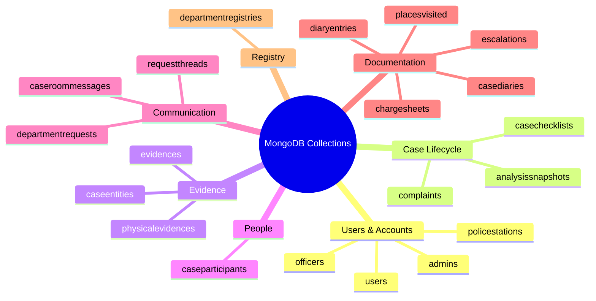
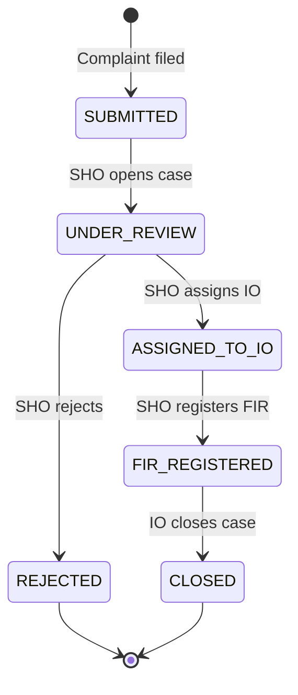
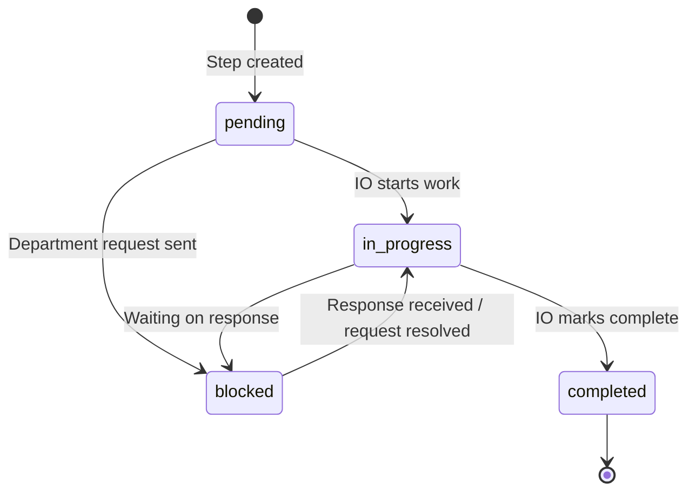
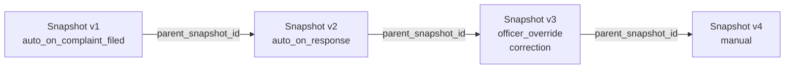
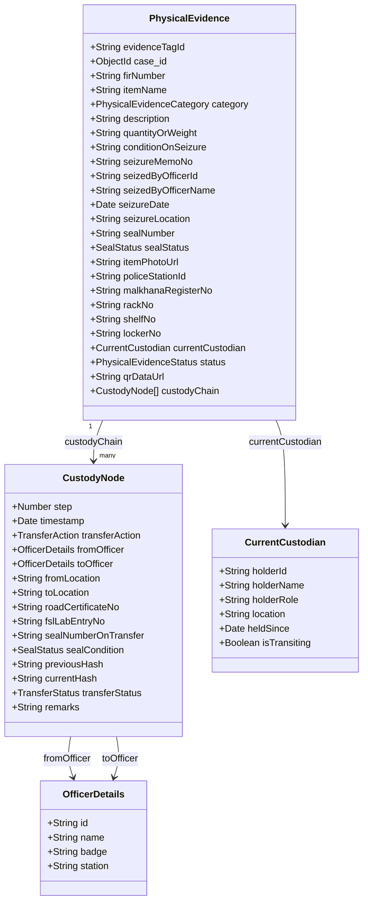
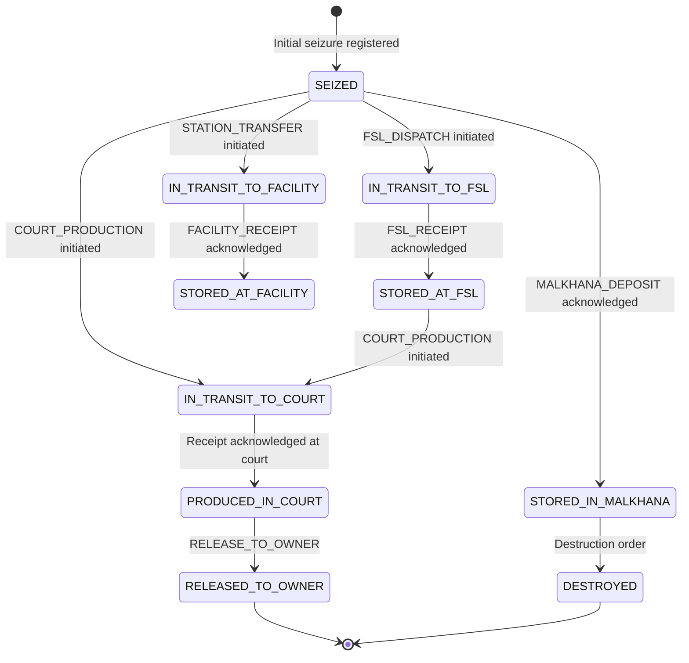
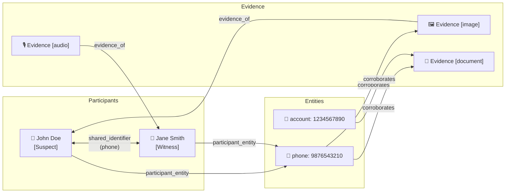
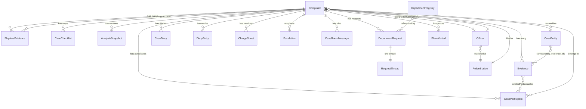

# Crime OS — Database Schema

> All collections use MongoDB. Schemas are defined with Mongoose. Every collection (except `DiaryEntry`) uses `timestamps: true` (`createdAt` / `updatedAt` auto-managed). `versionKey: false` throughout.

---

## Table of Contents

1. [Shared Sub-Schemas](#1-shared-sub-schemas)
2. [Admin](#2-admin)
3. [PoliceStation](#3-policestation)
4. [Officer](#4-officer)
5. [User (Citizen)](#5-user-citizen)
6. [DepartmentRegistry](#6-departmentregistry)
7. [Complaint](#7-complaint)
8. [Evidence](#8-evidence)
9. [CaseChecklist](#9-casechecklist)
10. [AnalysisSnapshot](#10-analysissnapshot)
11. [CaseParticipant](#11-caseparticipant)
12. [DepartmentRequest](#12-departmentrequest)
13. [RequestThread](#13-requestthread)
14. [CaseDiary](#14-casediary)
15. [DiaryEntry](#15-diaryentry)
16. [PlaceVisited](#16-placevisited)
17. [CaseEntity](#17-caseentity)
18. [ChargeSheet](#18-chargesheet)
19. [Escalation](#19-escalation)
20. [CaseRoomMessage](#20-caseroommessage)
21. [PhysicalEvidence](#21-physicalevidence)
22. [Knowledge Graph (Conceptual)](#22-knowledge-graph-conceptual)
23. [Collection Relationships](#23-collection-relationships)

---

## Collection Overview

---

## 1. Shared Sub-Schemas

These embedded sub-schemas are reused across multiple collections.

### LegalSectionSuggestion
AI-suggested or manually selected legal section. Used wherever sections are recommended but not yet formally applied.

| Field | Type | Description |
|-------|------|-------------|
| `code` | String | Section identifier, e.g. `BNS-302` |
| `title` | String | Human-readable section title |
| `reason` | String? | Why this section applies to the case |

### AppliedLegalSection
Extends `LegalSectionSuggestion`. Used when an officer formally attaches a section.

| Field | Type | Description |
|-------|------|-------------|
| `code` | String | — |
| `title` | String | — |
| `reason` | String? | — |
| `attachedBy` | ObjectId → Officer | Officer who applied this section |
| `attachedAt` | Date | Timestamp of attachment |

---

## 2. Admin

Collection: `admins` — Platform administrator accounts. Admin has no access to investigation data.

| Field | Type | Constraints | Description |
|-------|------|-------------|-------------|
| `username` | String | unique, lowercase | Admin login username |
| `password` | String | select: false | Bcrypt-hashed password |

---

## 3. PoliceStation

Collection: `policestations` — Gujarat Police stations managed on the platform.

| Field | Type | Constraints | Description |
|-------|------|-------------|-------------|
| `name` | String | required | Full station name |
| `code` | String | unique, uppercase | Short immutable station code (e.g. `GJ-AHM001`) |
| `address` | String | required | Street address |
| `city` | String | required | — |
| `district` | String | required | — |
| `state` | String | default: `Gujarat` | — |
| `pincode` | String | required | — |
| `phone` | String | required | — |
| `email` | String | optional, lowercase | — |
| `isActive` | Boolean | default: true | Soft toggle — inactive stations are hidden from dropdowns |

**Note:** Any write to this collection automatically invalidates the Redis stations-list cache.

---

## 4. Officer

Collection: `officers` — SHO and IO accounts. Created only by admin; no self-registration.

| Field | Type | Constraints | Description |
|-------|------|-------------|-------------|
| `officerName` | String | required | — |
| `badgeNumber` | String | unique, uppercase | Police badge number — immutable identifier |
| `email` | String | unique, lowercase | Login email |
| `phone` | String | required | — |
| `role` | String | enum: `SHO`, `IO` | Determines access permissions throughout the system |
| `policeStation` | ObjectId → PoliceStation | required | Station this officer belongs to |
| `isActive` | Boolean | default: true | Deactivated officers cannot log in |
| `password` | String | select: false | Bcrypt-hashed |

---

## 5. User (Citizen)

Collection: `users` — Citizen profiles (legacy; not used in current officer-only flow but kept for reference).

| Field | Type | Description |
|-------|------|-------------|
| `firstName`, `middleName`, `lastName` | String | Full name |
| `username` | String? | Optional unique handle (sparse index) |
| `email` | String | Login email |
| `phone` | String | — |
| `password` | String | Bcrypt-hashed, select: false |
| `dateOfBirth` | Date | — |
| `gender` | String | enum: `male`, `female`, `other` |
| `address`, `city`, `district`, `state`, `pincode` | String | Full address |
| `idProofType` | String | enum: Aadhaar, PAN, Passport, VoterID, DrivingLicense |
| `idProofNumber` | String | Government ID number |
| `securityQuestion` | String? | For account recovery |
| `securityAnswer` | String? | select: false |
| `isEmailVerified` | Boolean | Account is inactive until email is verified via OTP |

---

## 6. DepartmentRegistry

Collection: `departmentregistries` — External agencies the IO can send formal information requests to (banks, telecom, forensic labs, courts, etc.).

| Field | Type | Description |
|-------|------|-------------|
| `entity_id` | String | Unique short identifier used as a foreign key throughout the system |
| `entity_name` | String | Full display name |
| `category` | String | Department category (e.g. `Bank`, `Telecom`, `Forensic`) |
| `what_they_can_provide` | String[] | List of information types this department can supply |
| `legal_basis_typically_cited` | String[] | BNSS/IPC sections typically cited when requesting from this department |
| `request_format_expected` | String | Format preference of the department |
| `typical_response_time` | String | e.g. `7-10 working days` |
| `escalation_path_if_no_response` | String | What to do if the department doesn't respond |
| `notes_or_caveats` | String | Special notes for the IO when making a request |
| `confidence` | String | enum: `high`, `medium`, `low` — reliability rating of this department |
| `contact_email` | String? | Email address where request letters are sent |
| `qdrant_uuid` | String? | Qdrant point UUID — set on first embed; used for targeted vector update/delete |
| `isActive` | Boolean | Inactive departments are hidden from the request composer and removed from Qdrant |

---

## 7. Complaint

Collection: `complaints` — Central record for each complaint filed. The primary document linking all investigation data.

### Core Fields

| Field | Type | Description |
|-------|------|-------------|
| `complaintNumber` | String | UUID-based unique identifier shown to officers (e.g. `COMP-a3f7...`) |
| `status` | String | Lifecycle state: `SUBMITTED` → `UNDER_REVIEW` → `ASSIGNED_TO_IO` → `FIR_REGISTERED` → `CLOSED` (or `REJECTED`) |
| `citizen` | ObjectId → User | Complainant reference |
| `policeStation` | ObjectId → PoliceStation | Station where the complaint was filed |
| `assignedSHO` | ObjectId → Officer | SHO handling this complaint |
| `assignedIO` | ObjectId → Officer | IO assigned to investigate |
| `incidentDate` | Date | When the incident occurred |
| `incidentTime` | String? | Time of incident (optional, in addition to date) |
| `incidentPlace` | String | Location description |
| `approximateDateText` | String? | Plain-language date if exact date unknown |
| `coordinates` | String? | GPS coordinates of incident |
| `category` | String? | enum from `ComplaintCategory` — official Gujarat Police crime category |
| `crimeCategory` | String? | Free-text category override or supplemental label |
| `shortDescription` | String | One-line summary (max 255 chars) |
| `detailedDescription` | String | Full account of the incident |
| `currentVersionNumber` | Number | Increments with each IO edit to the complaint |

Complaint status lifecycle:

### History Arrays

Each stores a versioned audit trail of edits. Every entry has: `version` (Number), `editedBy` (`Citizen`/`SHO`/`IO`), `editorId`, `content`, `timestamp`.

| Field | Tracks |
|-------|--------|
| `descriptionHistory` | Changes to the detailed description |
| `crimeSummaryHistory` | AI or officer crime summary revisions |
| `legalSectionsHistory` | Changes to applied legal sections |
| `investigationNotesHistory` | IO investigation notes revisions |

### Evidence Sub-documents

`evidence[]` — Each uploaded file embedded directly on the complaint:

| Field | Description |
|-------|-------------|
| `publicId` | Cloudinary public ID |
| `secureUrl` | Cloudinary HTTPS URL |
| `resourceType`, `mimeType`, `extension` | File type metadata |
| `originalFilename`, `size` | — |
| `uploadedBy` | ObjectId → User |
| `processingStatus` | `PENDING` / `PROCESSED` / `FAILED` — updated by the Python pipeline |
| `applicableSections[]` | Legal sections attached to this specific file |
| `aiMetadata` | Full AI extraction output (OCR text, speech transcript, image tags, object detection, faces, GPS/EXIF, AI summary, classification + confidence, dimensions) |
| `isPhysical` | True for physically seized items |
| `physicalDetails` | `name`, `description`, `locationFound`, `currentLocation` — for physical items |

### FIR Fields

| Field | Description |
|-------|-------------|
| `firNumber` | Unique FIR number assigned on registration (sparse unique index) |
| `firRegisteredAt`, `firRegisteredBy` | When and by whom the FIR was registered |
| `firPdfUrlEn` | Cloudinary URL of the English FIR PDF |
| `firPdfUrlGujEn` | Cloudinary URL of the bilingual Gujarati-English FIR PDF |
| `firPdfUrl` | Legacy single PDF URL (kept for backward compatibility) |
| `firFormData` | Cached JSON of the 15-section FIR form for SHO editing before finalization |

### AI Intelligence

`complaintIntelligence` — Populated by the Python Complaint Intelligence pipeline:

| Sub-field | Description |
|-----------|-------------|
| `category` | AI-classified crime category |
| `summary` | AI-written case summary |
| `entities[]` | Extracted people, organisations, accounts (name + type) |
| `timeline[]` | Reconstructed chronological event sequence |
| `people_and_entities` | Structured entity breakdown |
| `evidence_analysis[]` | Per-evidence AI analysis |
| `crime_analysis` | Overall crime type analysis |
| `missing_information[]` | Information the AI identified as absent |
| `missing_evidence[]` | Evidence types the AI recommends collecting |
| `sections` | Legal section mapping from the intelligence pipeline |

**Indexes:** `status`, `citizen`, `policeStation`, `assignedIO`

---

## 8. Evidence

Collection: `evidences` — Detailed evidence records created by the investigation module (separate from the embedded evidence on `Complaint`). Enriched by the Python AI pipeline after upload.

### Core Fields

| Field | Type | Description |
|-------|------|-------------|
| `case_id` | ObjectId → Complaint | — |
| `evidence_id` | String | UUID — unique identifier |
| `type` | String | `image`, `audio`, `video`, `document`, `physical_device`, etc. |
| `storage_ref` | String | Cloudinary public_id or storage key |
| `ai_description` | String? | Short AI-generated caption |
| `ai_tags` | String[] | Quick-access keyword tags |
| `uploader_id` | ObjectId → Officer | — |
| `status` | String | enum: `pending`, `verified`, `rejected` |
| `source` | String? | Who provided it: `complainant`, `io_officer`, `department`, `cyber_analyst` |
| `origin` | String? | `post_complaint_request` — marks evidence uploaded by citizen via token link |
| `linked_diary_entry_id` | String? | Diary entry where this evidence was first recorded |
| `linked_request_id` | String? | Department/citizen request this evidence came from |
| `relatedParticipantIds` | ObjectId[] → CaseParticipant | Participants this evidence is linked to |
| `applicableSections` | LegalSectionSuggestion[] | BSA sections attached to this evidence |
| `processingStatus` | String | `PENDING` / `PROCESSED` / `FAILED` — set by the Python pipeline |
| `originalFilename`, `mimeType`, `size` | — | — |

### Physical Evidence Fields (on Evidence collection)

> These fields are for *linked* physical context on digital evidence. For dedicated physical item tracking, see [PhysicalEvidence](#21-physicalevidence).

| Field | Description |
|-------|-------------|
| `is_physical` | True for physically seized items |
| `current_location` | Where the item is currently held (default: `malkhana`) |
| `custody_chain[]` | Transfer history — each entry: `timestamp`, `from_entity`, `to_entity`, `status` (`dispatched`/`received`/`in_transit`/`returned`), `proof_storage_ref`, `notes` |

### AI Metadata

`aiMetadata` — Populated by the Python Complaint Intelligence pipeline:

| Sub-field | Description |
|-----------|-------------|
| `ocrText` | Text extracted from images/scanned PDFs via PaddleOCR |
| `speechTranscript` | Audio transcription from faster-whisper |
| `pdfText` | Text extracted from digital PDFs via PyMuPDF |
| `imageTags` | Florence-2 keyword tags |
| `detectedObjects` | Objects identified by Florence-2 |
| `faces` | Face detection results |
| `embeddings` | Vector embedding of the evidence content |
| `virusScanResult` | Malware scan outcome |
| `aiSummary` | Paragraph summary of what the evidence contains |
| `classification` | AI-assigned evidence category |
| `classificationConfidence` | Confidence score (0.0–1.0) |
| `width`, `height` | Image/video dimensions in pixels |
| `fileType` | MIME-level type detection |
| `exif` | EXIF metadata (camera, timestamps, device info) |
| `gps` | GPS coordinates extracted from file metadata |
| `processingErrors` | Any errors during pipeline processing |

### Deepfake Detection

| Field | Type | Description |
|-------|------|-------------|
| `confidence_score` | Number (0–100) | AI Deepfake Confidence Score from SightEngine. `0–30` = Likely Real, `30–70` = Uncertain, `70–100` = Likely AI-Generated/Manipulated. Defaults to `0` if detection is disabled or unavailable. |

### Encryption

The `Evidence` collection uses the **`evidenceEncryptionPlugin`** which automatically encrypts sensitive fields using **AES-256-GCM** before persistence and decrypts them transparently on read. The following fields are encrypted at rest:

`storage_ref`, `ai_description`, `ai_tags`, `current_location`, `custody_chain`, `originalFilename`, `aiMetadata.ocrText`, `aiMetadata.speechTranscript`, `aiMetadata.pdfText`, `aiMetadata.imageTags`, `aiMetadata.detectedObjects`, `aiMetadata.faces`, `aiMetadata.embeddings`, `aiMetadata.aiSummary`, `aiMetadata.exif`, `aiMetadata.gps`

| Field | Description |
|-------|-------------|
| `isEncrypted` | Boolean flag. Set to `true` automatically by the plugin pre-save hook. Used by the post-find hook to decide whether decryption is needed. |

**Indexes:** `(case_id, status)`, `(case_id)` (primary lookup)

---

## 9. CaseChecklist

Collection: `casechecklists` — Investigation steps auto-generated from SOPs when a case is assigned, plus any manually added steps.

| Field | Type | Description |
|-------|------|-------------|
| `case_id` | ObjectId → Complaint | — |
| `sop_id` | String | ID of the SOP this step came from |
| `step_id` | String | UUID — unique step identifier |
| `title` | String | Step description |
| `status` | String | enum: `pending`, `blocked`, `in_progress`, `completed` |
| `criticality` | String | enum: `high`, `medium`, `low` — used in confidence score weighting (high=3, medium=2, low=1) |
| `required_evidence` | String[] | Description of what evidence this step requires |
| `proof_evidence_ids` | String[] | Evidence IDs that have been attached to satisfy this step |
| `locked_by_request_id` | String? | Set when a department/citizen request is sent; step stays `blocked` until response arrives |
| `department_entity_id` | String? | Which external department this step involves |
| `target` | String? | Free-text target (person, organisation) for this step |
| `completed_by` | ObjectId → Officer | — |
| `completed_at` | Date | — |

Checklist step lifecycle:

**Indexes:** `(case_id, status)`, `(case_id, sop_id)`

---

## 10. AnalysisSnapshot

Collection: `analysissnapshots` — A versioned record of the AI's analysis of the case at a specific point in time.

### Core Fields

| Field | Type | Description |
|-------|------|-------------|
| `case_id` | ObjectId → Complaint | — |
| `snapshot_id` | String | UUID — unique per snapshot |
| `timestamp` | Date | When this snapshot was created |
| `trigger` | String | `manual`, `auto_on_complaint_filed`, `auto_on_response`, `officer_override` |
| `facts_used` | Mixed | The exact assembled facts object fed to the LLM — preserved for audit/diff |
| `narrative_summary` | String | Markdown narrative written by the LLM summarising the case state |
| `confidence_breakdown` | Mixed | All confidence scoring components (evidence coverage, checklist progress, corroboration) |
| `officer_authored` | Boolean | True if this snapshot was created manually by an officer without LLM involvement |
| `parent_snapshot_id` | String? | Links to the previous snapshot — forms a chain for correction/diff tracking |

Snapshot chain (corrections create a linked list):

### Recommendation Arrays

**`ranked_next_steps[]`** — Actions the AI recommends the IO take next.

**`suspect_candidates[]`** — Persons identified as potential suspects with supporting/contradicting evidence.

**`participant_recommendations[]`** — Suggested case participants with roles, confidence, and AI reasoning.

**`evidence_section_recommendations[]`** — Per-evidence legal section suggestions (BSA sections).

**`suggested_legal_sections[]`** — Case-level BNS/BNSS/BSA sections.

**Indexes:** `(case_id, timestamp desc)` — most recent snapshot is the primary query

---

## 11. CaseParticipant

Collection: `caseparticipants` — All people formally connected to a case: victims, witnesses, suspects, accused, complainants.

| Field | Type | Description |
|-------|------|-------------|
| `case_id` | ObjectId → Complaint | — |
| `participant_id` | String | UUID — unique identifier |
| `name` | String | Full name |
| `contact` | Object? | `phone`, `email`, `address` |
| `identifiers[]` | — | Govt IDs, phone numbers, etc. — also used by Knowledge Graph shared_identifier edges |
| `roles[]` | String[] | enum: `Victim`, `Witness`, `Suspect`, `Accused`, `Complainant` |
| `statements[]` | — | Formal recorded statements |
| `reasoning[]` | — | Investigative reasoning notes |

### Role-Specific Profiles

**`suspectProfile`**

| Field | Description |
|-------|-------------|
| `appliedSections[]` | AppliedLegalSection[] — BNS sections formally attached to this suspect |
| `isAccused` | Set to true when the suspect is promoted to Accused |

**`victimProfile`** — `injuryDetails`, `lossDetails`

**`witnessProfile`** — `evidenceIds[]` (evidence this witness is linked to)

**`complainantProfile`** — `relationshipToIncident`

**Indexes:** `(case_id, roles)`, `(case_id, name)`, `(case_id, identifiers.value)`

---

## 12. DepartmentRequest

Collection: `departmentrequests` — Formal information request letters sent by the IO to external departments or citizens.

| Field | Type | Description |
|-------|------|-------------|
| `case_id` | ObjectId → Complaint | — |
| `request_id` | String | UUID |
| `step_id` | String | Checklist step this request is linked to |
| `request_type` | String | `external_department`, `inter_station_assignment`, `citizen_request` |
| `department_entity_id` | String? | References DepartmentRegistry — not set for citizen requests |
| `draft_content` | String | Full text of the AI-drafted letter |
| `status` | String | `draft` → `reviewed` → `sent` → `acknowledged` → `response_received` → `overdue` |
| `token` | String? | One-time secure token embedded in the citizen's email link |
| `token_expires_at` | Date? | Expiry of the citizen token |

**Indexes:** `(case_id, status)`, `(case_id, step_id)`

---

## 13. RequestThread

Collection: `requestthreads` — Conversation thread between the IO and a department or citizen.

| Field | Type | Description |
|-------|------|-------------|
| `case_id` | ObjectId → Complaint | — |
| `request_id` | String | Matches `DepartmentRequest.request_id` — one thread per request |
| `department_entity_id` | String? | Department entity (null for citizen threads) |
| `step_title` | String | Title of the checklist step this thread belongs to |
| `unread_by_io` | Boolean | Set true when a department/citizen reply arrives |
| `messages[]` | — | Full conversation history (sender, content, timestamp, attachments) |

---

## 14. CaseDiary

Collection: `casediaries` — Official Roznamcha (case diary) documents.

| Field | Type | Description |
|-------|------|-------------|
| `case_id` | ObjectId → Complaint | — |
| `diary_id` | String | UUID |
| `diary_date` | Date | The date this diary entry covers |
| `diary_number` | Number | Sequential diary number for this case |
| `status` | String | `draft` → `completed` → `finalized` |
| `generated_by` | String | `ai` or `officer` |
| `record_of_investigation` | String? | Raw mixed-language investigation narrative |
| `record_of_investigation_guj_en` | String? | Gujarati-English bilingual narrative |
| `record_of_investigation_en` | String? | English-only narrative |
| `pdf_url`, `pdf_url_guj_en`, `pdf_url_en` | String? | Cloudinary URLs for generated PDFs |
| `structured_data` | Mixed? | Parsed tabular data (e.g. bank accounts, transaction layers) |

---

## 15. DiaryEntry

Collection: `diaryentries` — **Append-only** auto-log of every meaningful event. The backbone of the automated case diary.

> **Enforcement:** Schema-level `pre` hooks throw on any `updateOne`, `findOneAndUpdate`, or delete. Records are immutable once created.

| Field | Type | Description |
|-------|------|-------------|
| `case_id` | ObjectId → Complaint | — |
| `entry_id` | String | UUID |
| `timestamp` | Date | Exact time of the event |
| `actor.type` | String | `officer`, `system`, `department` |
| `actor.id` | String | Officer ID, system identifier, or department entity ID |
| `event_type` | String | One of ~28 enum values (see below) |
| `payload` | Mixed | Event-specific data — varies by `event_type` |
| `ref_ids` | Object | Cross-references: `evidence_id`, `request_id`, `step_id`, `participant_id`, `snapshot_id` |

### Event Types

| Category | Event Types |
|----------|-------------|
| Filing | `complaint_filed` |
| Evidence | `evidence_added`, `evidence_sections_attached` |
| Checklist | `checklist_step_completed`, `manual_step_added` |
| Requests | `request_drafted`, `request_sent`, `response_received` |
| Analysis | `analysis_run`, `suggestion_generated`, `override_correction` |
| Participants | `participant_recommendation_approved`, `participant_added_manually`, `participant_updated`, `participant_deleted`, `participant_sections_attached`, `participant_promoted_to_accused`, `participant_statement_added`, `participant_reasoning_attached`, `participant_identifier_uploaded` |
| Diary | `diary_draft_generated`, `diary_finalized`, `case_diary_draft_created`, `case_diary_completed`, `place_visited_added`, `witness_added` |
| Other | `officer_note`, `escalation_raised` |

**Indexes:** `(case_id, timestamp asc)`, `(case_id, event_type)`

---

## 16. PlaceVisited

Collection: `placesvisited` — Locations visited by the IO during investigation. Used in Case Diary generation.

| Field | Type | Description |
|-------|------|-------------|
| `case_id` | ObjectId → Complaint | — |
| `place_id` | String | UUID |
| `address` | String | Full address |
| `coordinates` | Object? | `lat`, `lng` — GPS coordinates |
| `visit_date` | Date | — |
| `start_time`, `end_time` | String? | HH:MM visit window |
| `what_was_done` | String? | What the officer did at this location |
| `source` | String? | How this record was created (e.g. `diary_finalization`) |
| `event_type` | String? | Classification of visit (e.g. `crime_scene`, `witness_location`) |

---

## 17. CaseEntity

Collection: `caseentities` — Distinct entities (phone numbers, bank accounts, UPI IDs, IMEIs, names) extracted and tracked across a case. These become **entity nodes** in the Knowledge Graph.

| Field | Type | Description |
|-------|------|-------------|
| `case_id` | ObjectId → Complaint | — |
| `entity_type` | String | e.g. `phone`, `account`, `upi`, `imei`, `name` |
| `value` | String | The actual extracted value |
| `first_seen_entry_id` | String | DiaryEntry `entry_id` where this entity was first noted |
| `corroborating_evidence_ids[]` | String[] | Evidence IDs that mention or corroborate this entity — used to build `corroborates` edges in the Knowledge Graph |

**Indexes:** `(case_id, entity_type)`, `(case_id, value)`

---

## 18. ChargeSheet

Collection: `chargesheets` — Final legal document assembled from all case artifacts. Multiple versions can exist per case.

| Field | Description |
|-------|-------------|
| `case_id` | ObjectId → Complaint |
| `victimIds[]`, `witnessIds[]`, `accusedIds[]`, `suspectIds[]` | ObjectId[] → CaseParticipant |
| `applicableLegalSections[]` | Case-level LegalSectionSuggestion[] |
| `appliedSectionsByAccused[]` | Per-accused sections |
| `evidenceIds[]` | All Evidence records included |
| `briefCaseDescription` | AI-generated short summary |
| `investigationSummary` | AI-generated overview of how investigation was conducted |
| `investigationFindings` | AI-generated key findings and evidence analysis |
| `finalReport` | AI-generated conclusions and court recommendations |
| `filingMetadata` | `status`, `filingNumber`, `courtName`, `filedAt`, `filedBy`, `notes` |
| `version` | Increments with each regeneration |

**Unique index:** `(case_id, version)`

---

## 19. Escalation

Collection: `escalations` — Records of case escalations.

| Field | Type | Description |
|-------|------|-------------|
| `case_id` | ObjectId → Complaint | — |
| `escalation_id` | String | UUID |
| `reason` | String | IO's stated reason or auto-detected condition |
| `triggered_at` | Date | — |
| `summary` | String | AI-written 2–3 sentence professional escalation summary |
| `sent_to` | String | Recipient — SHO badge/ID or department name |
| `status` | String | `pending` → `sent` → `resolved` |

**Index:** `(case_id, status)`

---

## 20. CaseRoomMessage

Collection: `caseroommessages` — Encrypted real-time chat messages exchanged between IOs within a case's Private Chatroom.

| Field | Type | Constraints | Description |
|-------|------|-------------|-------------|
| `case_id` | ObjectId → Complaint | required, indexed | The case this message belongs to |
| `message_id` | String | unique, default: `uuidv4()` | UUID |
| `sender_id` | ObjectId → Officer | required | Officer who sent the message |
| `sender_name` | String | required | Denormalized for quick display |
| `content` | String | required | AES-256-GCM encrypted ciphertext. Format: `enc:<iv>:<ciphertext>:<authTag>` |
| `isEncrypted` | Boolean | default: `true` | Always `true` |
| `sent_at` | Date | default: `Date.now` | Precise timestamp |

**Indexes:** `(case_id)`, `(case_id, sent_at asc)`

---

## 21. PhysicalEvidence

Collection: `physicalevidences` — Dedicated BNSS-compliant physical evidence tracking with cryptographic custody chains and Malkhana integration.

### Category Enum

| Value | Description |
|-------|-------------|
| `WEAPON` | Firearms, knives, blunt objects |
| `NARCOTICS` | Drugs, controlled substances |
| `VEHICLE` | Cars, motorcycles, etc. |
| `DOCUMENT` | Papers, IDs, contracts |
| `STOLEN_PROPERTY` | Items reported as stolen |
| `BIOLOGICAL` | Blood samples, hair, DNA swabs |
| `ELECTRONIC_DEVICE` | Phones, laptops, hard drives |
| `OTHER` | Anything else |

### Status Lifecycle

### CustodyNode Sub-document (Cryptographic Chain)

| Field | Type | Description |
|-------|------|-------------|
| `step` | Number | Sequential step number starting at 1 |
| `timestamp` | Date | When this transfer occurred |
| `transferAction` | String | enum: `INITIAL_SEIZURE`, `MALKHANA_DEPOSIT`, `FSL_DISPATCH`, `FSL_RECEIPT`, `COURT_PRODUCTION`, `STATION_TRANSFER`, `HOSPITAL_MEDICAL_DISPATCH`, `FACILITY_DISPATCH`, `FACILITY_RECEIPT`, `RELEASE_TO_OWNER` |
| `fromOfficer` | OfficerDetails | Officer handing the item over |
| `toOfficer` | OfficerDetails | Officer receiving the item |
| `fromLocation` | String | Transfer origin |
| `toLocation` | String | Transfer destination |
| `roadCertificateNo` | String? | Road Certificate number for transit |
| `fslLabEntryNo` | String? | FSL lab entry number on receipt |
| `sealNumberOnTransfer` | String | Seal ID verified at this transfer |
| `sealCondition` | String | `INTACT` / `DAMAGED` / `RE_SEALED` |
| `previousHash` | String | SHA-256 hash of the previous node (genesis = `"0000...0"`) |
| `currentHash` | String | SHA-256 of: `previousHash|step|transferAction|fromOfficerId|toOfficerName|toLocation|timestamp|sealNo|roadCertNo` |
| `transferStatus` | String | `DISPATCHED` / `ACCEPTED` / `REJECTED` |
| `remarks` | String? | Optional notes |

**Indexes:** `evidenceTagId` (unique), `case_id`

---

## 22. Knowledge Graph (Conceptual)

The Knowledge Graph is **not a persisted collection**. It is dynamically assembled on demand by the **`CaseGraphService`** (`backend/src/modules/investigation/services/caseGraphService.ts`) by querying three existing collections in parallel. The result — a `{ nodes[], edges[] }` object — is returned directly to the frontend for visualization and injected as context into the LLM prompt during analysis.

### Node Types

| `nodeType` | Source Collection | Label Format | Key `meta` Fields |
|------------|-------------------|--------------|-------------------|
| `participant` | `CaseParticipant` | Person's name | `roles[]`, `identifiers[]` |
| `entity` | `CaseEntity` | `{entity_type}: {value}` | `entity_type`, `value`, `corroborating_evidence_ids[]` |
| `evidence` | `Evidence` | `Evidence [{type}]` | `type`, `status`, `evidence_id` |

### Edge Types

| `relationship` | Direction | Inferred From |
|----------------|-----------|---------------|
| `corroborates` | entity → evidence | `CaseEntity.corroborating_evidence_ids` |
| `evidence_of` | evidence → participant | `Evidence.relatedParticipantIds` |
| `shared_identifier` | participant ↔ participant | O(n²) match on `identifiers[].value` |
| `participant_entity` | participant → entity | Identifier value matches `CaseEntity.value` |

### High-Signal Insights (used in LLM prompt)

The `buildGraphContextSummary()` method scans the graph and produces plain-text insights that are directly injected into the AI analysis prompt:

- **Shared identifiers:** `"Participant A and Participant B share identifier 'phone: 9876543210' [flagged: shared_identifier]"`
- **Multi-corroborated entities:** `"Entity phone '9876543210' is corroborated by 3 pieces of evidence [flagged: multi-corroborated]"`

These surface hidden connections the LLM would otherwise miss when reasoning only from raw case text.

---

## 23. Collection Relationships

---

*Crime OS — Built for Gujarat Police | SVNIT*
