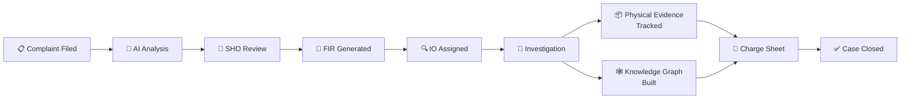
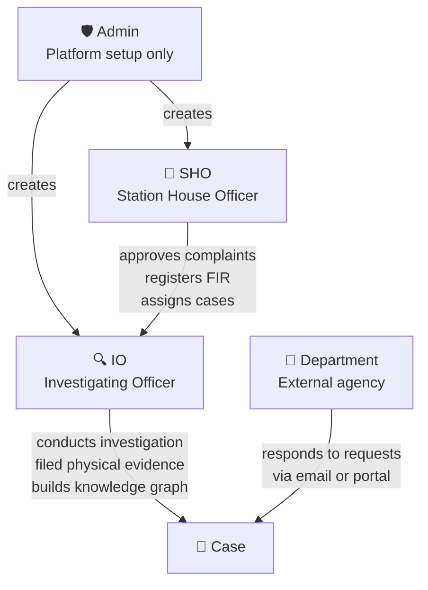
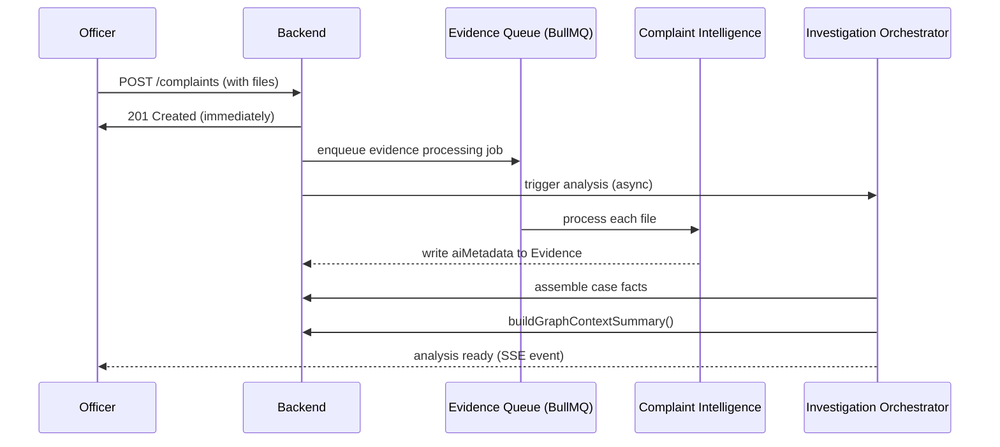
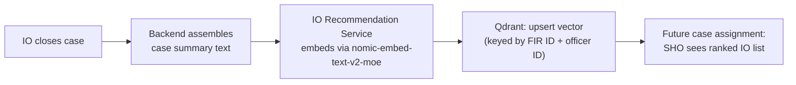
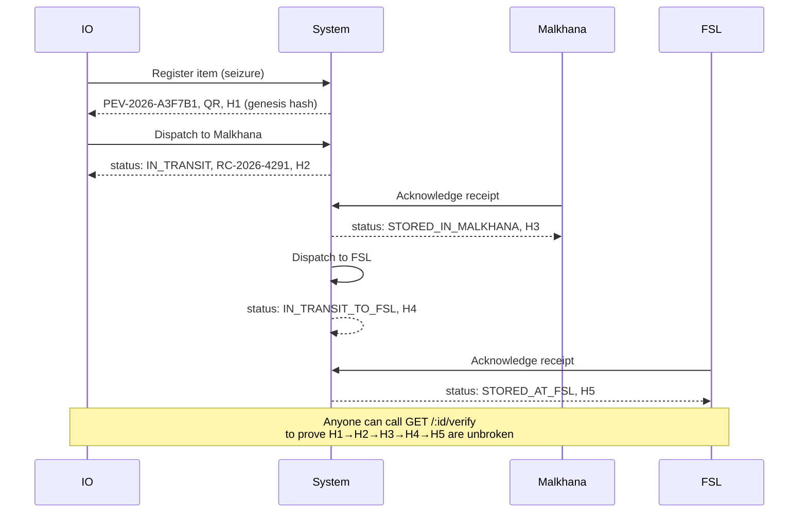
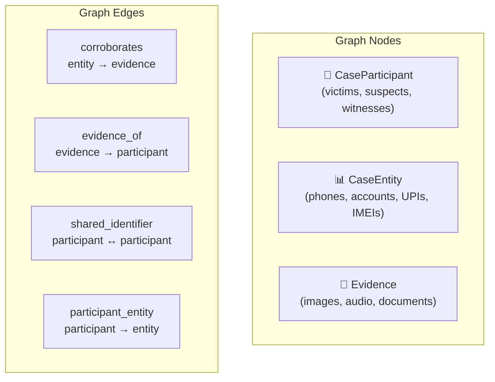
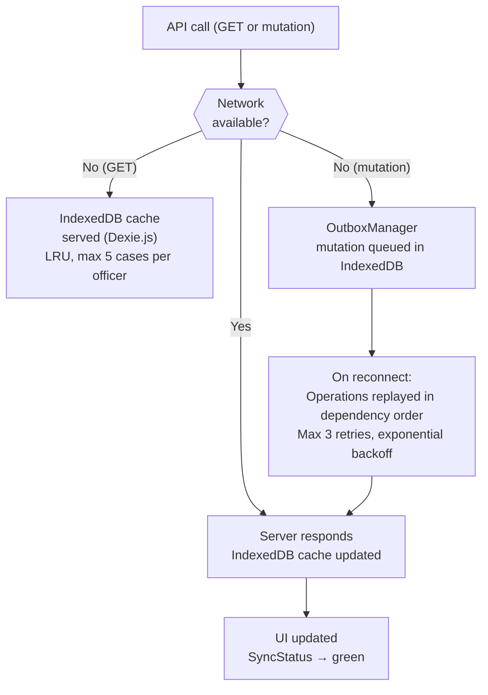

# Crime OS — AI-Powered Police Investigation Management Platform

> Crime OS is a comprehensive digital platform built to assist police officers throughout the entire lifecycle of a criminal investigation — from complaint intake to charge sheet generation. It combines structured case management with deeply integrated AI to reduce manual effort, surface critical insights, and ensure nothing falls through the cracks.


##  Live Demo

Experience the deployed Crime OS platform:

 **[Open Crime OS Live Demo](https://crimeos-lemon.vercel.app/login)**

 ### Credentials

Use the following credentials to explore the platform:

| Role | Email | Password |
|---|---|---|
| **IO (Investigating Officer)** | `io@police.gov.in` | `password123` |
| **SHO (Station House Officer)** | `sho@police.gov.in` | `password123` |
 

For the technical architecture, component design, data flows, security model, and deployment topology, see [SYSTEM_ARCHITECTURE.md](./SYSTEM_ARCHITECTURE.md).

---

## Table of Contents

1. [Platform Overview](#1-platform-overview)
2. [User Roles & Access](#2-user-roles--access)
3. [Functional Workflows](#3-functional-workflows)
   - [Complaint Filing — Multi-Modal Ingestion](#complaint-filing--multi-modal-ingestion)
   - [Automatic Background Processing](#automatic-background-processing)
   - [SHO Workflow](#sho-workflow)
   - [IO Workflow](#io-workflow)
   - [Case Closure & Vector Embedding](#case-closure--vector-embedding)
   - [Multi-Language Support](#multi-language-support)
4. [Advanced Features](#4-advanced-features)
   - [Physical Evidence Tracking & Cryptographic Custody Chain](#physical-evidence-tracking--cryptographic-custody-chain)
   - [Knowledge Graph & Case Corkboard](#knowledge-graph--case-corkboard)
   - [Progressive Web App & Offline-First Support](#progressive-web-app--offline-first-support)
   - [Evidence Encryption & Watermarking](#evidence-encryption--watermarking)
   - [Multiple IO Collaboration & Private Chatroom](#multiple-io-collaboration--private-chatroom)
   - [AI Deepfake Detection for Media](#ai-deepfake-detection-for-media)
   - [Prompt Compression for Efficient LLM Processing](#prompt-compression-for-efficient-llm-processing)
   - [Vector Quantization for Scalability](#vector-quantization-for-scalability)
5. [Tech Stack](#5-tech-stack)
6. [Dependencies & Requirements](#6-dependencies--requirements)
7. [Setup & Installation](#7-setup--installation)

---

## 1. Platform Overview

Crime OS is an internal police operations platform — there is no public-facing or citizen-facing side. Every user on the platform is a verified police officer. The system is designed to digitize and accelerate the investigative process, bringing AI assistance at every step so officers can focus on decision-making rather than paperwork.

The platform covers the full investigation lifecycle:



---

## 2. User Roles & Access



| Role | Full Name | Primary Responsibility |
|---|---|---|
| **SHO** | Station House Officer | Reviews incoming complaints, confirms FIRs, assigns cases to IOs |
| **IO** | Investigating Officer | Conducts the full investigation of assigned cases |

Officer accounts are created exclusively by the **Admin**. Officers cannot self-register. This ensures that only verified, credentialed personnel have access to the system.

---

## 3. Functional Workflows

### Complaint Filing — Multi-Modal Ingestion

Any officer (SHO or IO) can file a complaint on behalf of a complainant. Crime OS supports **Multi-Modal Complaint Ingestion** — meaning the complaint can be submitted in whatever form the information arrives, without forcing the officer to manually transcribe everything.

| Input Type | How It's Processed |
|---|---|
| **Manual entry** | Officer types details directly into the structured form |
| **Image upload** | Florence-2 + PaddleOCR extract objects, text, GPS metadata |
| **PDF upload** | PyMuPDF extracts text layer; Florence OCR handles scanned pages |
| **Audio upload** | faster-whisper transcribes speech, detects language, translates |
| **Video upload** | scenedetect extracts keyframes, Florence captions, Whisper transcribes audio |

For **evidence**, the same multi-modal support applies — all file types can be attached to a case.

---

### Automatic Background Processing

The moment a complaint is submitted, two processes begin working simultaneously:



1. **Evidence Intelligence** — every file is processed automatically (OCR, transcription, object detection, NER, GPS extraction, deepfake scoring).
2. **Case Analysis** — complaint text and all evidence are analyzed together by the AI Orchestrator, which also calls the Knowledge Graph service to enrich the LLM prompt with hidden connections.

---

### SHO Workflow

#### Reviewing the Complaint

New complaints appear on the SHO's dashboard immediately after filing. The SHO can view the complete original complaint — every field entered, every file attached — exactly as it was submitted.

#### AI Case Analysis

Alongside the original complaint, the SHO sees a fully generated **AI analysis of the case** — a structured investigation-level analysis that includes a narrative explanation, identified entities, and applicable legal sections retrieved via RAG from BNS/BNSS/BSA.

#### Evidence Analysis

Each piece of evidence is individually analyzed — extracted text, transcription, detected objects, GPS metadata, AI summary, classification, and a **Deepfake Confidence Score** (0–100). Scores ≥ 70 display a warning badge.

#### FIR Generation & Confirmation

When the SHO is ready to formally register the case, they click **Generate FIR**. The platform produces a complete FIR document in the official Gujarat Police format — all fields auto-populated from case data, presented as an editable form. Once confirmed:

- A unique FIR number is assigned
- A **downloadable PDF** is generated in both English and bilingual Gujarati-English formats
- The FIR PDF is watermarked with the organization logo (15% opacity, centered) and stored in Cloudinary

#### Assigning the Case to an IO

After FIR confirmation, the SHO sees a **ranked list of suggested IOs** ordered by how similar this case is to each officer's past closed cases. The IO Recommendation service powers this — vector embeddings of closed cases are searched via cosine similarity in Qdrant, and officers are ranked 0–100 with match reasoning.

---

### IO Workflow

Once assigned, the case appears on the IO's dashboard within the **Investigation Workspace** — a unified interface with all investigation tools.

#### AI Analysis & Investigation Intelligence

The AI analysis recommends concrete next steps, suggests participants (victim, witness, suspect) with AI reasoning, and retrieves applicable legal sections (BNS for suspects, BSA for evidence) via RAG.

#### AI Copilot

The IO has a **Copilot** available at all times in two modes:

- **ASK Mode** — factual questions answered with full legal context retrieved by the Legal Agent RAG
- **AGENT Mode** — the agent fetches the complete live case state, re-runs the full AI pipeline, and returns a structured proposal the IO can review and apply

#### Department Communication

AI auto-generates **ready-to-send formal draft letters** to external departments (forensic labs, banks, courts, telecom providers) with correct BNSS citations and deadlines. When a department replies, the platform's Gmail poller automatically picks it up, attaches it to the case, unblocks the checklist step, and re-triggers analysis.

#### Case Participants

For each person connected to the case, the IO can maintain:

- Contact details and government identifiers (Aadhaar, PAN, IMEI, etc.)
- Formal statements — typed directly or auto-transcribed from audio by faster-whisper
- Progressive Reasoning notes — evolving, editable, collaboratively maintained with the AI Copilot
- Applied BNS/BSA legal sections with officer attribution and timestamp

Suspects can be **promoted to Accused** which propagates the status to the charge sheet.

#### Physical Evidence Management

See [Physical Evidence Tracking & Cryptographic Custody Chain](#physical-evidence-tracking--cryptographic-custody-chain).

#### Knowledge Graph / Case Corkboard

See [Knowledge Graph & Case Corkboard](#knowledge-graph--case-corkboard).

#### Case Diary

The **Case Diary** (official Roznamcha) practically writes itself:

- Every platform action is automatically logged as a `DiaryEntry` with an AI-generated professional summary
- The IO can generate a formatted bilingual diary draft at any time (Ollama-powered)
- Finalized diaries are compiled into official Roznamcha PDFs (English + Gujarati-English) with watermarks, stored in Cloudinary

#### Confidence Score

A **dynamic Confidence Score** (%) reflects the strength of the case at any moment, updated automatically based on:
- Evidence coverage of required items
- Checklist completion progress
- Corroboration between evidence items

#### Charge Sheet Generation

When the investigation concludes, Crime OS assembles a comprehensive charge sheet automatically:

- All accused (with statements, identifiers, applied legal sections)
- All evidence with AI analysis and BSA section mappings
- All department request outcomes
- Full case diary and Roznamcha entries
- An **Annexures section** with direct Cloudinary links to source documents
- Four AI-generated narrative sections (editable before finalization)

Available as a downloadable PDF at any point; versioned as the document evolves.

---

### Case Closure & Vector Embedding

When the investigation concludes:



All case data remains permanently accessible — nothing is deleted.

---

### Multi-Language Support

| Language | Script |
|---|---|
| English | Latin |
| Hindi | Devanagari |
| Gujarati | Gujarati script |

Every interface element, label, AI-generated content, analysis narrative, draft letters, case diary, and FIR document is available in the officer's preferred language. Translation is done on first visit to each page via Ollama, then cached in Redis for near-zero latency on subsequent visits.

---

## 4. Advanced Features

### Physical Evidence Tracking & Cryptographic Custody Chain

Crime OS implements a full **BNSS-compliant physical evidence management system** — covering the complete lifecycle of seized items from initial seizure through Malkhana storage, FSL dispatch, court production, and final release or destruction.

**What can be tracked:**

| Category | Examples |
|---|---|
| WEAPON | Firearms, knives, blunt objects |
| NARCOTICS | Drugs, controlled substances |
| VEHICLE | Cars, motorcycles |
| DOCUMENT | Papers, IDs, contracts |
| STOLEN_PROPERTY | Items reported as stolen |
| BIOLOGICAL | Blood, hair, DNA swabs |
| ELECTRONIC_DEVICE | Phones, laptops, hard drives |
| OTHER | Any other seized item |

**How it works:**

1. **Registration** — The IO registers the seized item. The system generates:
   - A unique `evidenceTagId` (e.g. `PEV-2026-A3F7B1`)
   - A QR code linking to the public verification URL (`/verify-custody/{tagId}`)
   - The Genesis hash (step 1 of the cryptographic chain)

2. **Cryptographic Custody Chain** — Every custody transfer (dispatch to FSL, receipt at court, Malkhana deposit, etc.) appends a new `CustodyNode` to the chain. Each node contains:
   - The SHA-256 hash of the previous node's hash plus all transfer parameters
   - Transfer details: from/to officer, from/to location, Road Certificate number, seal condition
   - Status: `DISPATCHED` → `ACCEPTED` (two-step per transfer)

   Hash computation:
   ```
   currentHash = SHA-256(
     previousHash | step | transferAction | fromOfficerId | toOfficerName |
     toLocation | timestamp | sealNumber | roadCertificateNo
   )
   ```

3. **Two-step Transfer Protocol**:
   - **Dispatch** (`POST /dispatch`) — IO initiates transfer, status becomes `IN_TRANSIT_*`, a Road Certificate number is assigned
   - **Acknowledge** (`POST /acknowledge`) — Receiving officer confirms receipt, verifies seal condition, step is marked `ACCEPTED`

4. **Integrity Verification** — `GET /:id/verify` re-computes every hash in the chain from scratch and reports the exact step where any tampering occurred.



**Physical Evidence status lifecycle:**

| From Status | Action | To Status |
|---|---|---|
| `SEIZED` | FSL_DISPATCH | `IN_TRANSIT_TO_FSL` |
| `SEIZED` | COURT_PRODUCTION | `IN_TRANSIT_TO_COURT` |
| `SEIZED` | STATION_TRANSFER | `IN_TRANSIT_TO_FACILITY` |
| Any IN_TRANSIT | Acknowledge (FSL) | `STORED_AT_FSL` |
| Any IN_TRANSIT | Acknowledge (Court) | `PRODUCED_IN_COURT` |
| Any IN_TRANSIT | Acknowledge (Malkhana) | `STORED_IN_MALKHANA` |
| `PRODUCED_IN_COURT` | RELEASE_TO_OWNER | `RELEASED_TO_OWNER` |
| `STORED_IN_MALKHANA` | Destruction order | `DESTROYED` |

---

### Knowledge Graph & Case Corkboard

Crime OS builds a **dynamic Knowledge Graph** for every case — surfacing hidden connections between people, entities, and evidence that the IO might miss by reading raw case data alone.

**What the graph maps:**



**How edges are inferred (automatically, in-memory):**

| Edge Type | How it's detected |
|---|---|
| `corroborates` | `CaseEntity.corroborating_evidence_ids` references evidence IDs |
| `evidence_of` | `Evidence.relatedParticipantIds` references participant IDs |
| `shared_identifier` | O(n²) check — two participants share the same identifier value (phone number, Aadhaar, IMEI, etc.) |
| `participant_entity` | A participant's identifier value matches a `CaseEntity.value` |

**Two consumers:**

1. **AI Orchestrator** — `buildGraphContextSummary()` extracts high-signal insights from the graph and injects them directly into the LLM's analysis prompt:
   - *"Participant A and Participant B share identifier 'phone: 9876543210' [flagged: shared_identifier]"*
   - *"Entity phone '9876543210' is corroborated by 3 pieces of evidence [flagged: multi-corroborated]"*
   
   This means the AI analysis actively reasons about hidden connections, not just raw case text.

2. **Case Corkboard (frontend)** — The `CaseCorkboard` component (`frontend/src/components/case/CaseCorkboard.tsx`) calls `GET /api/v1/cases/:id/graph` and renders the `{ nodes[], edges[] }` response as an interactive node-edge visualization — the classic detective "string board" digitized. Officers can visually explore which suspects are connected, what evidence links to whom, and which entities appear across multiple participants.

The graph is built dynamically on demand — no pre-built graph is stored in the database. It's cached in the PWA's offline IndexedDB store for offline viewing.

---

### Progressive Web App & Offline-First Support

Crime OS is deployed as a **Progressive Web App (PWA)** with full offline-first capability.

**Offline layer architecture:**



**Cached resources per case include:** AI analysis snapshots, investigation checklists, case diary entries, evidence metadata, case participants, request threads, room messages, **knowledge graph data**, and department list.

---

### Evidence Encryption & Watermarking

**Encryption:**
- **Algorithm** — AES-256-GCM (256-bit key, Galois/Counter Mode with random IV per value)
- **Format** — `enc:<iv_hex>:<ciphertext_hex>:<authTag_hex>`
- **Applied to** — 16 sensitive Evidence fields (OCR text, transcripts, GPS, tags, etc.) via the `evidenceEncryptionPlugin` Mongoose plugin, and all Private Chatroom messages via `CaseRoomService`
- **Transparent** — encryption and decryption happen entirely in Mongoose hooks; application code is unaware

**Watermarking:**
- **Applied to** — All generated PDFs: charge sheets, FIRs, case diary Roznamchas
- **Format** — Organization SVG logo, 15% opacity, centered on every page, scaled to 65% of page width

---

### Multiple IO Collaboration & Private Chatroom

Cases can be assigned to multiple IOs for complex or high-priority investigations. The **Private Chatroom** provides secure real-time communication:

- **Real-time** — Socket.io WebSocket connection authenticated via JWT
- **Encrypted** — all messages encrypted with AES-256-GCM before MongoDB persistence
- **Room eligibility** — enforced: minimum 2 assigned IOs required
- **Case Diary sidebar** — chatroom displays the diary timeline in a resizable split view

---

### AI Deepfake Detection for Media

Every uploaded image, audio, and video evidence is automatically scanned by the **SightEngine API** for deepfake indicators:

| Score Range | Interpretation |
|---|---|
| 0–30 | Likely Real |
| 30–70 | Uncertain (manual review recommended) |
| 70–100 | Likely AI-Generated/Manipulated |

Scores ≥ 70 display a warning badge in the Evidence panel. Configurable via `SIGHTENGINE_ENABLE_DEEPFAKE_CHECK`.

---

### Prompt Compression for Efficient LLM Processing

**LLMLingua-2** (`microsoft/llmlingua-2-bert-base-multilingual-cased-meetingbank`, ~110 MB BERT model) reduces prompt token count before every major LLM call:

| Applied to | Typical reduction |
|---|---|
| Case analysis full text | 30–50% |
| Copilot AGENT mode (case facts + legal context) | 30–50% |
| Department request letter drafts | 20–40% |
| Charge sheet narrative generation | 30–50% |

Critical tokens (dates, phone numbers, names) are never removed. Graceful fallback — if the service times out (60s), the original uncompressed text is passed to the LLM without error.

---

### Vector Quantization for Scalability

The **Qdrant vector database** supports optional **Scalar Quantization** per collection:

- **Memory reduction** — ~75% less space per vector (32-bit floats → 8-bit integers)
- **Search quality** — typically < 2% degradation in retrieval accuracy
- **Collections** — Legal sections collection (BNS/BNSS/BSA/SOPs) + Closed case embeddings collection (IO Recommendation)
- **Configuration** — `quantization_enabled` and `quantization_always_ram` flags per collection

---

## 5. Tech Stack

### Application Layer

| Layer | Technology |
|---|---|
| **Frontend** | Next.js 14 (App Router), React 18, TypeScript, Tailwind CSS |
| **Backend API** | Node.js / Express (TypeScript) |
| **Database** | MongoDB with Mongoose ODM |
| **File Storage** | Cloudinary (direct signed-URL uploads) |
| **Caching & Queues** | Redis + BullMQ |
| **Email** | Nodemailer + Gmail OAuth2 |
| **PDF Generation** | PDFKit with NotoSansGujarati font for Gujarati script |
| **Real-time** | Socket.io WebSocket (Private Chatroom) + SSE (Analysis Progress) |
| **Offline** | Dexie.js (IndexedDB) + @ducanh2912/next-pwa |

### Python AI Microservices

| Service | Port | Purpose |
|---|---|---|
| Complaint Intelligence | 8000 | Evidence processing pipeline (PDF, image, audio, video, NER) |
| Florence-2 | 8002 | Image captioning and OCR (resident in memory) |
| IO Recommendation | 8003 | Closed-case vector search + officer ranking |
| Legal Agent | 8004 | Hybrid BM25 + vector RAG over BNS/BNSS/BSA/SOPs |
| Prompt Compression | 8005 | LLMLingua-2 token reduction before LLM calls |

### LLM Layer

| Component | Details |
|---|---|
| **Ollama** | gemma4:e2b, 32,768-token context window |
| Fast calls | temp=0.3, 512 tokens (summaries, factual answers, escalation drafts) |
| Deep calls | temp=0.1, 1024 tokens, JSON mode (analysis, charge sheet, department letters) |
| **nomic-embed-text-v2-moe** | GGUF Q4_K_M via llama.cpp — IO Recommendation + Legal Agent fallback |
| **BAAI/bge-base-en-v1.5** | sentence-transformers — Legal Agent primary embedder |
| **LLMLingua-2** | BERT-base multilingual — prompt compression |
| **ONNX cross-encoder** | Reranker for Legal Agent hybrid retrieval |

---

## 6. Dependencies & Requirements

### System Prerequisites

| Requirement | Version | Notes |
|---|---|---|
| **Node.js** | 20 LTS | Backend API + Frontend |
| **Python** | 3.12 | All Python AI services — **3.13 is not supported** (Florence-2 breaks) |
| **Docker Desktop** | Latest | Required to run Redis and Qdrant as containers |
| **Ollama** | Latest | Local LLM server for gemma4:e2b |
| **ffmpeg** | Any | Required by `moviepy` for video audio extraction — must be on system PATH |
| **MongoDB** | 6.0+ | Run locally or connect via Atlas URI |

### Node.js — Backend (`backend/package.json`)

| Package | Version | Purpose |
|---|---|---|
| `express` | ^4.19 | HTTP server and routing |
| `mongoose` | ^8.4 | MongoDB ODM |
| `bullmq` | ^5.8 | Background job queues |
| `ioredis` | ^5.4 | Redis client |
| `jsonwebtoken` | ^9.0 | JWT tokens |
| `bcrypt` | ^5.1 | Password hashing |
| `pdfkit` | ^0.19 | PDF generation |
| `cloudinary` | ^2.10 | Signed URL generation |
| `googleapis` | ^173 | Gmail OAuth2 |
| `nodemailer` | ^9.0 | SMTP email dispatch |
| `socket.io` | latest | WebSocket server (Private Chatroom) |
| `axios` | ^1.7 | HTTP calls to Python services |
| `joi` | ^17.13 | Request body validation |
| `multer` | ^2.2 | Multipart file upload |
| `qrcode` | ^1.5 | QR code generation for physical evidence |
| `crypto` (built-in) | — | SHA-256 custody chain hashing, AES-256-GCM encryption |

### Node.js — Frontend (`frontend/package.json`)

| Package | Version | Purpose |
|---|---|---|
| `next` | 14.2.23 | App Router framework |
| `react` / `react-dom` | ^18 | UI rendering |
| `typescript` | ^5 | Type safety |
| `tailwindcss` | ^3.4 | Utility CSS |
| `axios` | ^1.18 | API calls |
| `react-hook-form` | ^7.81 | Form state management |
| `react-markdown` | ^10.1 | Renders AI markdown responses |
| `@ducanh2912/next-pwa` | latest | PWA / service worker generation |
| `dexie` | ^4 | IndexedDB wrapper for offline case caching |
| `socket.io-client` | latest | WebSocket client for Private Chatroom |

### Python Services — Key Dependencies

| Service | Key Packages |
|---|---|
| Complaint Intelligence | `fastapi`, `faster-whisper`, `pymupdf`, `scenedetect`, `moviepy`, `spacy`, `paddleocr` |
| Florence-2 | `torch`, `transformers`, `einops`, `timm` |
| Legal Agent | `qdrant-client`, `sentence-transformers`, `optimum[onnxruntime]`, `onnxruntime` |
| IO Recommendation | `qdrant-client`, `httpx` (calls llama.cpp) |
| Prompt Compression | `llmlingua`, `torch` |

### External Services Required

| Service | Purpose | Setup |
|---|---|---|
| **MongoDB** | Primary database | Local install or MongoDB Atlas URI |
| **Cloudinary** | File + PDF storage | Create a free account at cloudinary.com |
| **Gmail account** | Department email dispatch + polling | Enable OAuth2 in Google Cloud Console |
| **SightEngine** | AI deepfake detection for media evidence | Create account at sightengine.com |

---

## 7. Setup & Installation

### Step 1 — Clone & verify Python version

```bash
git clone <repo-url>
cd CRIME_OS

# Confirm Python 3.12 is active — 3.13 breaks Florence-2
python --version
```

---

### Step 2 — Start Docker services (Redis + Qdrant)

Docker Desktop must be running before anything else.

```bash
docker run -d --name crime-os-redis -p 6379:6379 redis:alpine
docker run -d --name crime-os-qdrant -p 6333:6333 -p 6334:6334 qdrant/qdrant
```

---

### Step 3 — Create shared Python virtual environment

```bash
python -m venv .venv

# Windows
.venv\Scripts\activate

# macOS / Linux
source .venv/bin/activate

# Install all Python service dependencies
pip install -r services/complaint_intelligence/requirements.txt
pip install -r services/florence_service/requirements.txt
pip install -r services/legal_agent/requirements.txt
pip install -r services/io-recommendation/requirements.txt
pip install -r services/prompt_compression/requirements.txt

# Download spaCy NER model
python -m spacy download en_core_web_sm

# Export ONNX reranker weights for Legal Agent (one-time)
cd services/legal_agent
python export_weights.py
cd ../..
```

---

### Step 4 — Install and pull the LLM

Install Ollama from [ollama.com](https://ollama.com), then pull the model:

```bash
ollama pull gemma4:e2b
```

---

### Step 5 — Install backend dependencies

```bash
cd backend
npm install
cp .env.example .env
```

Required values in `backend/.env`:

| Variable | Description |
|---|---|
| `MONGODB_URI` | MongoDB connection string |
| `JWT_ACCESS_SECRET` | Random secret (min 32 chars) |
| `JWT_REFRESH_SECRET` | Different random secret |
| `COOKIE_SECRET` | Random secret for signed cookies |
| `CLOUDINARY_CLOUD_NAME` / `API_KEY` / `API_SECRET` | From your Cloudinary dashboard |
| `GMAIL_CLIENT_ID` / `CLIENT_SECRET` / `REFRESH_TOKEN` | From Google Cloud Console |
| `GMAIL_POLICE_EMAIL` | Gmail address used for sending/receiving |
| `ENCRYPTION_KEY` | 32-byte hex string for AES-256-GCM encryption |
| `SIGHTENGINE_API_USER` / `API_KEY` | From sightengine.com |
| `SIGHTENGINE_ENABLE_DEEPFAKE_CHECK` | `true` / `false` (default: `true`) |
| `SIGHTENGINE_TIMEOUT_MS` | Timeout in ms (default: `30000`) |
| `PROMPT_COMPRESSION_ENABLED` | `true` / `false` |
| `FRONTEND_URL` | e.g. `http://localhost:3000` |

---

### Step 6 — Install frontend dependencies

```bash
cd frontend
npm install
```

---

### Step 7 — Seed the database

```bash
cd backend
npx ts-node src/scripts/seed-police.ts
```

---

### Step 8 — Ingest the legal knowledge base into Qdrant

```bash
cd services/legal_agent

# Embed all parsed records (legal sections + SOPs + dept registry)
python -m ingestion.embed_records parsed --out embedded/all_embeddings.jsonl

# Ingest into Qdrant (must be running on :6333)
python -m ingestion.ingest_qdrant embedded/all_embeddings.jsonl
```

---

### Step 9 — Start everything

Run the startup script from the project root:

```bash
start_all.bat
```

This opens separate terminal windows for each service in the correct startup order.

### Service Port Reference

| Service | Port |
|---|---|
| Next.js Frontend | 3000 |
| Node.js Backend | 5001 |
| Complaint Intelligence | 8000 |
| Florence-2 | 8002 |
| IO Recommendation | 8003 |
| Legal Agent | 8004 |
| Prompt Compression | 8005 |
| Ollama | 11434 |
| llama.cpp (nomic embeddings) | 8080 |
| MongoDB | 27017 |
| Redis | 6379 |
| Qdrant HTTP | 6333 |
| Qdrant gRPC | 6334 |

The platform is ready when all windows show their startup messages. Open `http://localhost:3000` to access the application.

---

*Crime OS — Built for Gujarat Police | SVNIT*
