# Crime OS — System Architecture

> Technical reference for the Crime OS platform architecture — covering system design, component responsibilities, data flows, inter-service communication, security model, and deployment topology.

For a functional overview of the platform and user workflows, see [README.md](./README.md).

---

## Table of Contents

1. [Architecture Diagram](#1-architecture-diagram)
2. [Component Responsibilities](#2-component-responsibilities)
3. [Major Data & Request Flows](#3-major-data--request-flows)
   - [Flow 1 — Complaint Filing → Evidence Processing → AI Analysis](#flow-1--complaint-filing--evidence-processing--ai-analysis)
   - [Flow 2 — Copilot Query (ASK & AGENT mode)](#flow-2--copilot-query-ask--agent-mode)
   - [Flow 3 — Department Request → Email → Reply → Case Update](#flow-3--department-request--email--reply--case-update)
   - [Flow 4 — Case Closure → Vector Embedding → IO Recommendation](#flow-4--case-closure--vector-embedding--io-recommendation)
4. [Component Communication](#4-component-communication)
5. [Security & Access Architecture](#5-security--access-architecture)
6. [Deployment Architecture](#6-deployment-architecture)
7. [Project Folder Structure](#7-project-folder-structure)

---

## 1. Architecture Diagram

The diagram below shows the complete system — every service, every data store, and every major data flow.

```mermaid
flowchart TD
    %% ── Styling ──────────────────────────────────────────────────────────────
    classDef ui        fill:#1e3a5f,stroke:#4a90d9,color:#e8f4fd,rx:6
    classDef api       fill:#1a3a2a,stroke:#4caf7d,color:#e8f5e9,rx:6
    classDef db        fill:#3a1f00,stroke:#ff9800,color:#fff3e0,rx:6
    classDef pyservice fill:#2d1b4e,stroke:#9c64dd,color:#f3e5f5,rx:6
    classDef llm       fill:#3b1f1f,stroke:#ef5350,color:#ffebee,rx:6
    classDef queue     fill:#1a2a3a,stroke:#64b5f6,color:#e3f2fd,rx:6
    classDef external  fill:#2a2a2a,stroke:#aaaaaa,color:#f5f5f5,rx:6

    %% ══════════════════════════════════════════════════════════════════════════
    %% BROWSER LAYER
    %% ══════════════════════════════════════════════════════════════════════════
    subgraph BROWSER["🖥️  Browser — Next.js 14 Frontend"]
        direction LR
        UI_SHO["SHO Portal"]:::ui
        UI_IO["IO Investigation\nWorkspace"]:::ui
        UI_ADMIN["Admin Panel"]:::ui
        UI_DEPT["Department\nPortal"]:::ui
    end

    %% ══════════════════════════════════════════════════════════════════════════
    %% BACKEND API
    %% ══════════════════════════════════════════════════════════════════════════
    subgraph BACKEND["⚙️  Node.js / Express Backend API  (TypeScript)"]
        direction TB
        API_AUTH["Auth & JWT\nMiddleware"]:::api
        API_COMPLAINT["Complaint\nRoutes"]:::api
        API_INVEST["Investigation\nRoutes"]:::api
        API_FIR["FIR\nService"]:::api
        API_CHARGE["Charge Sheet\nGenerator"]:::api
        API_DEPT_REQ["Department\nRequest Service"]:::api
        API_ANALYSIS["Investigation\nOrchestrator"]:::api
        API_COPILOT["Copilot\nService"]:::api
        API_DIARY["Case Diary\nService"]:::api
        API_TRANSLATE["Translation\nService"]:::api
        API_IO_REC["IO Recommendation\nClient"]:::api
        SSE["SSE — Real-time\nAnalysis Progress"]:::api
    end

    %% ══════════════════════════════════════════════════════════════════════════
    %% DATA LAYER
    %% ══════════════════════════════════════════════════════════════════════════
    subgraph DATA["🗄️  Data Layer"]
        MONGO[("MongoDB\n— Complaints\n— Evidence\n— Participants\n— Diary\n— FIRs\n— Charge Sheets\n— Requests")]:::db
        REDIS[("Redis\n— Session Cache\n— Translation Cache\n— SSE Pub/Sub\n— Job State")]:::db
        CLOUDINARY[("Cloudinary CDN\n— Evidence Files\n— FIR PDFs\n— Diary PDFs\n— Charge Sheet PDFs")]:::external
    end

    %% ══════════════════════════════════════════════════════════════════════════
    %% QUEUES
    %% ══════════════════════════════════════════════════════════════════════════
    subgraph QUEUES["📬  BullMQ Background Queues  (Redis-backed)"]
        Q_EMAIL["Email Queue\n(Gmail OAuth2 / Nodemailer)"]:::queue
        Q_DIARY["Case Diary PDF\nQueue"]:::queue
        Q_EVIDENCE["Evidence\nProcessing Queue"]:::queue
    end

    %% ══════════════════════════════════════════════════════════════════════════
    %% PYTHON AI SERVICES
    %% ══════════════════════════════════════════════════════════════════════════
    subgraph PYTHON["🐍  Python FastAPI Microservices"]
        direction TB

        subgraph CI["Complaint Intelligence  :8000"]
            CI_PDF["PDF Worker\nPyMuPDF → text\nFallback → Florence OCR"]:::pyservice
            CI_IMG["Image Worker\nFlorence-2 caption\n+ PaddleOCR 2.7.3"]:::pyservice
            CI_AUD["Audio Worker\nfaster-whisper (tiny)\nVAD + auto-translate"]:::pyservice
            CI_VID["Video Worker\nscenedetect + moviepy\nKeyframes → Florence"]:::pyservice
            CI_NER["NER\nspaCy en_core_web_sm"]:::pyservice
        end

        FLORENCE["Florence-2 Service  :8002\nmicrosoft/Florence-2-base\n(CPU/CUDA, resident in memory)"]:::pyservice

        subgraph LA["Legal Agent  :8004"]
            LA_BM25["BM25 Search\n(keyword, schema-weighted)"]:::pyservice
            LA_VEC["Vector Search\n(Qdrant cosine)"]:::pyservice
            LA_FUSE["Weighted RRF Fusion\nBM25×0.4 + Vector×0.6"]:::pyservice
            LA_RERANK["ONNX Cross-Encoder\nReranker"]:::pyservice
            LA_OUT["Top 5 Legal\nContext Sections"]:::pyservice
        end

        IOREC["IO Recommendation  :8003\nnomic-embed-text-v2-moe Q4_K_M\n(llama.cpp) + Qdrant\nWeighted Voting Algorithm"]:::pyservice
    end

    %% ══════════════════════════════════════════════════════════════════════════
    %% LLMs
    %% ══════════════════════════════════════════════════════════════════════════
    subgraph LLM_LAYER["🤖  LLM Layer"]
        OLLAMA["Ollama  :11434\ngemma4:e2b\nctx=32 768 tokens\nFast calls: temp=0.3 / 512 tok\nDeep calls: temp=0.1 / 1024 tok"]:::llm
    end

    %% ══════════════════════════════════════════════════════════════════════════
    %% VECTOR DB
    %% ══════════════════════════════════════════════════════════════════════════
    QDRANT[("Qdrant  :6333\n— Legal sections\n  BNS · BNSS · BSA\n  SOPs · Dept Registry\n— Closed case vectors\n  IO Recommendation")]:::db

    %% ══════════════════════════════════════════════════════════════════════════
    %% EMBEDDING MODELS
    %% ══════════════════════════════════════════════════════════════════════════
    subgraph EMBED["📐  Embedding Models"]
        BGE["BAAI/bge-base-en-v1.5\n(sentence-transformers)\nLegal Agent — primary"]:::llm
        NOMIC["nomic-embed-text-v2-moe\n(llama.cpp / GGUF Q4_K_M)\nLegal Agent fallback +\nIO Recommendation"]:::llm
    end

    %% ══════════════════════════════════════════════════════════════════════════
    %% EXTERNAL
    %% ══════════════════════════════════════════════════════════════════════════
    GMAIL_POLL["Gmail API\n(OAuth2 Polling)\nDept reply ingestion"]:::external
    DEPT_EMAIL["External Departments\n(Forensic / Medical / Bank\n/ Telecom / Court …)"]:::external

    %% ══════════════════════════════════════════════════════════════════════════
    %% FLOWS — Browser → Backend
    %% ══════════════════════════════════════════════════════════════════════════
    BROWSER -->|"HTTPS REST + SSE"| BACKEND
    BACKEND --> API_AUTH
    API_AUTH --> API_COMPLAINT & API_INVEST & API_FIR & API_CHARGE & API_DEPT_REQ

    %% Backend → Data
    BACKEND <-->|"read / write"| MONGO
    BACKEND <-->|"cache / pub-sub"| REDIS
    BACKEND -->|"signed URL\nupload & fetch"| CLOUDINARY

    %% Backend → Queues
    API_COMPLAINT -->|"enqueue evidence job"| Q_EVIDENCE
    API_DEPT_REQ  -->|"enqueue email"| Q_EMAIL
    API_DIARY     -->|"enqueue PDF job"| Q_DIARY
    Q_EMAIL       -->|"send via SMTP\nor Gmail OAuth2"| GMAIL_POLL
    GMAIL_POLL    <-->|"send / poll replies"| DEPT_EMAIL

    %% Backend → Python services
    API_ANALYSIS  -->|"POST /analyze"| CI
    API_COPILOT   -->|"POST /copilot"| LA
    API_ANALYSIS  -->|"POST /copilot"| LA
    API_TRANSLATE -->|"POST /translate\n(page text blocks)"| OLLAMA
    API_IO_REC    -->|"POST /recommend-officers"| IOREC

    %% Orchestrator → LLM
    API_ANALYSIS  -->|"fast + deep\ngenerate calls"| OLLAMA
    API_FIR       -->|"bilingual FIR\nnarrative"| OLLAMA
    API_DIARY     -->|"Roznamcha\ndraft"| OLLAMA
    API_CHARGE    -->|"deep narrative\ngeneration"| OLLAMA

    %% Evidence pipeline (queue → CI service)
    Q_EVIDENCE    -->|"process evidence"| CI
    CI_PDF        -->|"scanned pages\nrouted to"| FLORENCE
    CI_IMG        -->|"image captioning"| FLORENCE
    CI_VID        -->|"keyframes\ncaptioning"| FLORENCE

    %% Legal Agent internal flow
    LA_BM25 --> LA_FUSE
    LA_VEC  --> LA_FUSE
    LA_FUSE --> LA_RERANK --> LA_OUT

    %% Legal Agent → Qdrant & Embeddings
    LA_VEC  -->|"vector search"| QDRANT
    BGE     -->|"embed query\n(primary)"| LA_VEC
    NOMIC   -.->|"embed query\n(fallback)"| LA_VEC

    %% IO Recommendation → Qdrant & Embeddings
    IOREC   <-->|"upsert closed case\n+ similarity search"| QDRANT
    NOMIC   -->|"embed complaint\n+ embed closed case"| IOREC

    %% SSE flow
    REDIS   -->|"analysis progress\nevents"| SSE
    SSE     -->|"real-time stream"| UI_IO

    %% PDF upload → CDN
    Q_DIARY  -->|"upload diary PDF"| CLOUDINARY
    API_FIR  -->|"upload FIR PDFs\n(EN + GUJ-EN)"| CLOUDINARY
    API_CHARGE -->|"stream charge\nsheet PDF"| BROWSER
```



---

## 2. Component Responsibilities

A plain-language breakdown of what each layer in the architecture is responsible for.

**Frontend (Next.js 14)**
The browser-side application. Renders all four portals — SHO, IO Investigation Workspace, Admin, and Department — as a single Next.js app using the App Router. Communicates with the backend exclusively over HTTPS REST and Server-Sent Events (SSE). Handles language selection and caches translated page text in Redis via the backend translation service.

**Backend API (Node.js / Express, TypeScript)**
The central coordination layer. All business logic lives here — complaint management, investigation orchestration, FIR generation, charge sheet assembly, case diary, department requests, and PDF generation. It is the only component that talks directly to MongoDB and Redis, and the only entry point for the frontend. It delegates all AI and ML work to the Python microservices over HTTP.

**MongoDB**
The primary data store. Holds every persistent entity: complaints, evidence records, case participants, analysis snapshots, diary entries, FIRs, charge sheets, department request threads, officer accounts, and station data. All relationships between entities are stored here.

**Redis**
Used for two purposes: short-lived caching (sessions, translated page text, analysis job state) and real-time pub/sub messaging (publishing analysis progress events that are forwarded to the browser as SSE streams).

**BullMQ Queues (Redis-backed)**
Three independent job queues handle work that must happen in the background without blocking an API response: evidence processing, email dispatch, and case diary PDF generation. Workers pick up jobs from these queues and process them asynchronously.

**Cloudinary CDN**
Cloud storage for all binary files — uploaded evidence (images, audio, video, documents) and generated PDFs (FIR, case diary, charge sheet). The backend generates a signed upload URL and sends it to the client; the browser uploads directly to Cloudinary without the file ever touching the backend server.

**Complaint Intelligence Service (Python FastAPI)**
Processes every evidence file. Routes each file type to the appropriate worker: PDFs to PyMuPDF, images to Florence-2 + PaddleOCR, audio to Whisper, video to scenedetect + moviepy + Florence. After processing, it runs spaCy NER across all extracted text and writes the enriched metadata back to MongoDB via the backend.

**Florence-2 Service (Python FastAPI)**
A dedicated REST wrapper around `microsoft/Florence-2-base`. Kept resident in memory to avoid repeated cold-start costs. Called internally by the Complaint Intelligence service for image captioning and OCR on scanned documents.

**Legal Agent Service (Python FastAPI)**
The RAG retrieval engine for all legal lookups. Maintains a hybrid BM25 + vector index over BNS, BNSS, BSA, SOPs, and the Department Registry. Returns the top 5 most relevant legal context sections for any query. Called by the backend during AI analysis and Copilot requests.

**IO Recommendation Service (Python FastAPI)**
Stores vector embeddings of every closed case in Qdrant. When a new case needs to be assigned, it finds the most similar historical cases and ranks the available IOs by how often they handled comparable work.

**Ollama (gemma4:e2b)**
The local LLM server. All text generation — analysis narratives, department letters, charge sheet sections, Copilot responses, diary drafts, translations — is served from here. Runs on the same machine as the backend.

**Qdrant**
The vector database. Two collections in use: one for the Legal Agent (legal sections + SOPs + Department Registry embeddings) and one for the IO Recommendation service (closed case embeddings). Queried via cosine similarity search.

---

## 3. Major Data & Request Flows

### Flow 1 — Complaint Filing → Evidence Processing → AI Analysis

```
Officer submits complaint (with evidence files)
  │
  ├─► Backend saves complaint to MongoDB (status: SUBMITTED)
  │
  ├─► Backend enqueues evidence processing job → Evidence Queue (BullMQ)
  │     └─► Evidence Worker picks up job
  │           ├─► PDF pages  → PyMuPDF (text) / Florence-2 (scanned pages)
  │           ├─► Images     → Florence-2 caption + PaddleOCR text
  │           ├─► Audio      → faster-whisper transcription + translation
  │           ├─► Video      → scenedetect keyframes → Florence-2 + Whisper
  │           └─► All text   → spaCy NER (people, places, orgs, dates)
  │                 └─► AI metadata written back to Evidence in MongoDB
  │
  └─► Backend triggers Investigation Orchestrator (async)
        ├─► Assembles all case facts from MongoDB
        ├─► Calls Legal Agent RAG → top 5 BNS/BNSS/BSA sections
        ├─► Calculates Confidence Score (evidence coverage + checklist progress)
        ├─► Calls Ollama gemma4:e2b (fast pass) → quick narrative
        ├─► Calls Ollama gemma4:e2b (deep pass, JSON mode) → full analysis snapshot
        │     (participants, legal sections, next steps, suspect candidates)
        ├─► Saves AnalysisSnapshot to MongoDB
        └─► Publishes progress events to Redis → SSE → IO browser (live progress bar)
```

### Flow 2 — Copilot Query (ASK & AGENT mode)

```
IO types a question or instruction into the Copilot
  │
  ├─► Backend receives query + current case ID
  │
  ├─► [Both modes] Calls Legal Agent Service
  │     ├─► BM25 keyword search over legal corpus
  │     ├─► Vector search in Qdrant (BGE/Nomic embeddings)
  │     ├─► Weighted RRF fusion (BM25×0.4 + Vector×0.6)
  │     ├─► ONNX reranker → top 5 context sections
  │     └─► Returns legal chunks + citations
  │
  ├─► [ASK mode] Backend calls Ollama (fast call)
  │     Input: question + retrieved legal context + case summary
  │     Output: direct answer → streamed back to browser
  │
  └─► [AGENT mode] Backend fetches complete case state from MongoDB
        ├─► Combines: full case facts + legal context + IO's instruction
        ├─► Calls Ollama (deep call, JSON mode)
        │     Output: updated analysis proposals (new participants,
        │             revised sections, new checklist steps, request drafts)
        ├─► Saves new AnalysisSnapshot (linked to parent via parent_snapshot_id)
        └─► Returns structured proposal cards to browser for IO review
```

### Flow 3 — Department Request → Email → Reply → Case Update

```
IO requests information from an external department
  │
  ├─► IO selects checklist step + department entity
  │
  ├─► Backend calls Ollama (deep call) → drafts formal letter
  │     (correct BNSS citations, specific data requested, deadline, IO sign-off)
  │
  ├─► IO reviews draft → clicks Send
  │
  ├─► Backend enqueues email job → Email Queue (BullMQ)
  │     └─► Email Worker dispatches via Gmail OAuth2 to department contact
  │
  ├─► Department receives email → logs into Department Portal
  │     ├─► Reads request thread
  │     ├─► Types response (optionally clicks "Format with AI" → Ollama rewrites it)
  │     └─► Submits response (optional file attachment)
  │
  └─► [Continuous polling — every 60 seconds]
        Gmail API polls for replies to the police inbox
          ├─► Incoming reply matched to open RequestThread by subject/thread ID
          ├─► Reply content saved as new message in RequestThread (MongoDB)
          ├─► Attachment (if any) saved as Evidence record
          ├─► Corresponding checklist step marked complete
          └─► Investigation Orchestrator re-triggered → fresh analysis snapshot
```

### Flow 4 — Case Closure → Vector Embedding → IO Recommendation

```
IO closes the investigation
  │
  ├─► Backend updates complaint status → CLOSED in MongoDB
  │
  ├─► Backend assembles case summary text
  │     (category, location, descriptions, participants, outcomes)
  │
  ├─► Backend calls IO Recommendation Service (fire-and-forget)
  │     ├─► Service embeds case text via nomic-embed-text-v2-moe (llama.cpp)
  │     └─► Vector upserted into Qdrant collection (keyed by FIR ID + officer ID)
  │
  └─► [On next IO assignment]
        SHO opens Assign IO screen
          ├─► Backend calls IO Recommendation Service
          │     ├─► New complaint embedded via nomic-embed-text-v2-moe
          │     ├─► Qdrant similarity search → top 50 similar closed cases
          │     │     (filtered by same station)
          │     ├─► Weighted voting: similarity scores accumulated per officer
          │     └─► Officers returned ranked 0–100 with reasons + match count
          └─► SHO sees ranked IO list → selects and assigns
```

---

## 4. Component Communication

**Frontend ↔ Backend**
All communication is over HTTPS. Standard REST calls (JSON request/response) handle all data reads, writes, and actions. Analysis progress is delivered as a **Server-Sent Events (SSE)** stream — the browser opens a persistent connection and the backend pushes stage updates as the orchestrator progresses through each step. No WebSockets are used.

**Backend ↔ Python Services**
Synchronous HTTP calls over the local network (all services run on the same host in development). The backend sends a JSON request and awaits the response before continuing. Evidence processing is the exception — it is triggered via the BullMQ queue, so the backend is never blocked waiting for file processing to finish.

**Backend ↔ MongoDB**
All reads and writes go through Mongoose ODM. The backend is the sole writer to MongoDB — no Python service touches the database directly. Python services return their results to the backend over HTTP, and the backend persists them.

**Backend ↔ Redis**
Two distinct uses: the BullMQ job queues (evidence, email, diary PDF) communicate through Redis as their broker, and the SSE pub/sub channel uses a Redis topic to relay orchestrator progress from the analysis worker to the SSE endpoint that the browser is connected to.

**AI Services ↔ Qdrant**
Both the Legal Agent and the IO Recommendation service communicate directly with Qdrant over HTTP (port 6333). The Legal Agent queries the legal corpus collection. The IO Recommendation service both writes (on case closure) and queries (on IO assignment) the closed-case collection. The backend never talks to Qdrant directly — all vector operations go through the Python services.

**Backend ↔ External Services**
Gmail OAuth2 is used bidirectionally: outbound emails are sent via the Gmail API (department request letters), and the backend polls the same Gmail inbox on a configurable interval (default 60 seconds) to ingest department replies. Cloudinary is used for file storage — the backend generates a short-lived signed upload URL, sends it to the browser, and the browser uploads directly. The backend later fetches file metadata and public URLs from Cloudinary as needed.

---

## 5. Security & Access Architecture

**Authentication**
All officer sessions are authenticated with **JWT (JSON Web Tokens)**. On login (badge number + password), the backend issues a short-lived access token (15 minutes) and a long-lived refresh token (7 days), both stored as signed HTTP-only cookies. Passwords are hashed with bcrypt. Token secrets are separate per token type (`JWT_ACCESS_SECRET` / `JWT_REFRESH_SECRET`).

**Authorization**
Every protected route passes through a role-check middleware before reaching the handler. The two roles — `SHO` and `IO` — have distinct permission boundaries enforced at the API level:

| Action | SHO | IO |
|---|---|---|
| View station complaint queue | ✓ | — |
| Approve / reject complaints | ✓ | — |
| Register FIR | ✓ | — |
| Assign case to IO | ✓ | — |
| Access Investigation Workspace | ✓ | ✓ (own cases only) |
| Generate charge sheet | ✓ | ✓ |
| Close case | ✓ | ✓ |
| Manage officer accounts | — | — (Admin only) |

**Admin isolation**
The Admin account is a completely separate credential type (username + password, no badge number) and has no access to any investigation data. Admin can only manage officer accounts, stations, and the department registry.

**Department Portal isolation**
Department users are separate accounts with no access to any case data beyond the specific request threads addressed to their entity.

**Data boundaries**
IOs can only access cases assigned to them — the API enforces this on every investigation endpoint. SHOs can access all cases within their station.

**Rate limiting**
API routes are protected with rate limiting (`rate-limiter-flexible`) to prevent abuse.

**File upload security**
Evidence files are never processed by the backend server. The backend issues a Cloudinary signed URL with a short expiry; the browser uploads directly. This eliminates a class of file-handling vulnerabilities on the server.

**Request validation**
All incoming request bodies are validated with Joi schema validators before reaching any business logic.

---

## 6. Deployment Architecture

All components run as separate processes, co-located on a single host with each service bound to its own port.

| Component | Runtime | Port |
|---|---|---|
| Next.js Frontend | Node.js | 3000 |
| Node.js Backend API | Node.js / Express | 5001 |
| Complaint Intelligence Service | Python / Uvicorn | 8000 |
| Florence-2 Service | Python / Uvicorn | 8002 |
| IO Recommendation Service | Python / Uvicorn | 8003 |
| Legal Agent Service | Python / Uvicorn | 8004 |
| Ollama (gemma4:e2b) | Ollama | 11434 |
| llama.cpp server (nomic embeddings) | llama.cpp | 8080 |
| MongoDB | MongoDB | 27017 |
| Redis | Redis | 6379 |
| Qdrant | Qdrant | 6333 |

**Frontend → Backend**
The Next.js frontend is a browser-rendered app. All API calls go to the backend at port 5001. The frontend origin is registered in the backend's CORS allowlist via `FRONTEND_URL`.

**Backend → Python services**
The backend reaches each Python service by its `localhost` address and configured port. Connection URLs are set via environment variables (`COMPLAINT_INTELLIGENCE_URL`, `LEGAL_AGENT_URL`, `IO_RECOMMENDATION_URL`).

**Python services → Qdrant**
Both the Legal Agent and IO Recommendation service connect to Qdrant at `localhost:6333`. Qdrant is run as a Docker container (`qdrant/qdrant:v1.9.1`), mounting a persistent volume so embeddings survive restarts.

**LLM access**
The backend connects to Ollama at `localhost:11434` with a 32,768-token context window. The llama.cpp server (for nomic embeddings) runs separately at port 8080 and is accessed only by the Python embedding services.

**File storage**
Cloudinary is a fully external cloud service. The backend holds API credentials and communicates with the Cloudinary API to generate signed URLs and retrieve file metadata. Actual file bytes travel between the browser and Cloudinary only — never through the backend.

**Email**
Gmail OAuth2 credentials are held by the backend. Outbound mail is dispatched through the Gmail API. Inbound polling runs on a timer within the backend process at a configurable interval (default 60 seconds).

**`start_all.bat`**
A single batch script at the project root starts all services in the correct order — MongoDB, Redis, Qdrant, Ollama, llama.cpp, each Python FastAPI service, the Node.js backend, and the Next.js frontend — for local development.

---

## 7. Project Folder Structure

```
CRIME_OS/
├── README.md                          # Platform overview, workflows, tech stack
├── SYSTEM_ARCHITECTURE.md             # This file — architecture reference
├── docker-compose.yml                 # Container definitions (Qdrant, etc.)
├── start_all.bat                      # Starts all services for local development
├── requirements.txt                   # Root-level Python deps (shared tooling)
│
├── backend/                           # Node.js / Express API (TypeScript)
│   └── src/
│       ├── app.ts                     # Express app setup, middleware registration
│       ├── server.ts                  # HTTP server entry point
│       ├── assets/fonts/              # NotoSansGujarati.ttf (embedded in PDFs)
│       ├── config/                    # env.ts, database, redis, bullmq, cloudinary, logger
│       ├── common/
│       │   ├── enums/                 # HTTP status codes
│       │   ├── errors/                # Typed error classes (Auth, Validation, NotFound…)
│       │   └── middlewares/           # authenticate, authorize, errorHandler, rateLimiter,
│       │                              #   requestId, validate
│       ├── modules/                   # Feature modules (each: controllers/routes/services/models/repos)
│       │   ├── admin/                 # Officer & station CRUD, department registry
│       │   ├── auth/                  # Login, refresh token, password reset
│       │   ├── caseUnderstanding/     # Case understanding proxy routes
│       │   ├── complaint/             # Complaint filing, status, FIR, evidence
│       │   ├── departmentPortal/      # Department login, inbox, reply endpoints
│       │   ├── investigation/         # Analysis, checklist, diary, participants,
│       │   │                          #   charge sheet, copilot, escalation, custody
│       │   ├── police/                # Officer profiles, station data
│       │   ├── translation/           # Translation endpoint (proxies to Ollama)
│       │   └── user/                  # User model & repository
│       └── shared/
│           ├── clients/               # legalAgentClient.ts, ioRecommendationClient.ts
│           ├── constants/             # Queue names, Redis key prefixes
│           ├── enums/                 # Roles, gender, ID proof types
│           ├── interfaces/            # IJwtPayload
│           ├── llm/                   # ollamaClient.ts, ollamaHealth.ts, geminiClient.ts
│           ├── queue/                 # BullMQ queues & workers:
│           │   │                      #   Analysis, CaseDiary, Email, FIR,
│           │   │                      #   GmailPoll, CaseDiaryAutoDraft
│           ├── services/
│           │   ├── email/             # Nodemailer email templates & sender
│           │   ├── gmail/             # Gmail OAuth2 poll service
│           │   └── complaintIntelligenceService.ts
│           └── utils/                 # analysisProgress (SSE pub), chargeSheetPdfGenerator,
│                                      #   hash, otp, response helpers
│
├── frontend/                          # Next.js 14 App Router (TypeScript)
│   └── src/
│       ├── app/
│       │   ├── (auth)/                # login/, register/, forgot-password/,
│       │   │                          #   reset-password/, verify-email/
│       │   ├── (dashboard)/
│       │   │   ├── dashboard/         # Officer home dashboard
│       │   │   └── police/dashboard/
│       │   │       └── complaints/
│       │   │           ├── page.tsx   # Station complaint queue (SHO) / case list (IO)
│       │   │           ├── new/       # Multi-modal complaint filing form
│       │   │           └── [id]/      # Case detail page
│       │   │               ├── page.tsx
│       │   │               ├── ChargeSheetModal.tsx
│       │   │               └── components/
│       │   │                   ├── InvestigationWorkspace.tsx   # Main 10-tab workspace
│       │   │                   ├── AnalysisPanel.tsx            # AI analysis + SSE progress
│       │   │                   ├── ChecklistPanel.tsx           # Investigation checklist
│       │   │                   ├── CaseDiaryFeed.tsx            # Diary entries + finalize
│       │   │                   ├── CopilotSidebar.tsx           # ASK / AGENT copilot
│       │   │                   ├── DepartmentInboxPanel.tsx     # Request threads
│       │   │                   ├── RequestComposerModal.tsx     # AI draft + send
│       │   │                   ├── ThreadViewerModal.tsx        # Thread reply + export
│       │   │                   ├── AddEvidenceModal.tsx
│       │   │                   ├── EvidenceViewerModal.tsx
│       │   │                   ├── ComplaintDetailModal.tsx
│       │   │                   ├── CaseSummaryBlock.tsx
│       │   │                   ├── SnapshotDetailModal.tsx
│       │   │                   ├── StepDetailModal.tsx
│       │   │                   ├── StepProofModal.tsx
│       │   │                   └── DiaryDetailModal.tsx
│       │   ├── (department)/department/   # Department portal (inbox, reply)
│       │   ├── admin/
│       │   │   ├── login/
│       │   │   ├── dashboard/             # Officers & stations CRUD
│       │   │   └── departments/           # Department registry CRUD
│       │   ├── department-portal/         # Department portal login page
│       │   └── citizen-response/[token]/  # Token-gated evidence upload (no login)
│       ├── components/
│       │   ├── ui/                    # Button, Card, Input, Modal, Select,
│       │   │                          #   Toast, FileUpload, Loader
│       │   ├── common/                # LanguageSelector, PortalBrand
│       │   ├── admin/                 # AdminNavbar
│       │   └── case-understanding/    # CaseUnderstandingView
│       ├── context/
│       │   ├── AuthContext.tsx        # JWT session state
│       │   └── TranslationContext.tsx # Active language + translated text cache
│       ├── hooks/                     # useAuth, useToast
│       └── lib/
│           ├── apiClient.ts           # Typed API call wrappers
│           ├── axios.ts               # Axios instance + interceptors
│           ├── types.ts               # Shared TypeScript types
│           └── i18n/                  # Language definitions, i18n helpers
│
├── services/                          # Python FastAPI microservices
│   ├── complaint_intelligence/        # Evidence processing pipeline  (:8000)
│   │   └── app/
│   │       ├── api/                   # FastAPI routes (evidence, case understanding)
│   │       ├── audio_worker/          # faster-whisper transcription + VAD
│   │       ├── image_worker/          # Florence-2 captioning + PaddleOCR
│   │       ├── pdf_worker/            # PyMuPDF text extraction + page renderer
│   │       ├── video_worker/          # scenedetect, keyframe extractor, moviepy
│   │       ├── ocr_worker/            # PaddleOCR engine (standalone)
│   │       ├── case_understanding/    # Pipeline orchestrator, context builder
│   │       ├── llm/                   # Ollama LLM client
│   │       ├── queue/                 # Redis job queue (worker runner)
│   │       ├── schemas/               # Pydantic models for all evidence types
│   │       └── core/                  # Config, logging, MongoDB, Redis, DI container
│   │
│   ├── florence_service/              # Florence-2 REST wrapper  (:8002)
│   │   └── app.py                     # Single-file FastAPI service, model resident in memory
│   │
│   ├── legal_agent/                   # RAG legal retrieval service  (:8004)
│   │   ├── app/                       # FastAPI app + /copilot + /registry endpoints
│   │   ├── legal_rag/                 # Retriever, BGE/Nomic embedder, Qdrant store
│   │   ├── ingestion/                 # Embed records, ingest to Qdrant
│   │   ├── extractors/                # PDF/OCR parsers for BNS, BNSS, BSA
│   │   ├── corpus/                    # Raw legal PDFs (BNS, BNSS, BSA, SOPs)
│   │   ├── parsed/                    # Parsed JSONL records
│   │   ├── embedded/                  # JSONL embedding output
│   │   ├── onnx_reranker/             # Exported ONNX cross-encoder weights
│   │   └── scripts/                   # evaluate_retrieval.py, run_legal_copilot.py
│   │
│   └── io-recommendation/             # IO recommendation service  (:8003)
│       └── app/
│           ├── api/routes/            # POST /embed-case, POST /recommend-officers
│           ├── services/              # embed_service, recommendation_service
│           ├── repositories/          # Qdrant upsert + search
│           ├── vector/                # nomic embedder (llama.cpp), Qdrant client
│           ├── schemas/               # Pydantic request/response models
│           └── core/                  # Config, logging
│
└── models/
    └── indictrans2/                   # IndicTrans2 model weights (translation, optional)
```

---

*Crime OS — Built for Gujarat Police | SVNIT*
