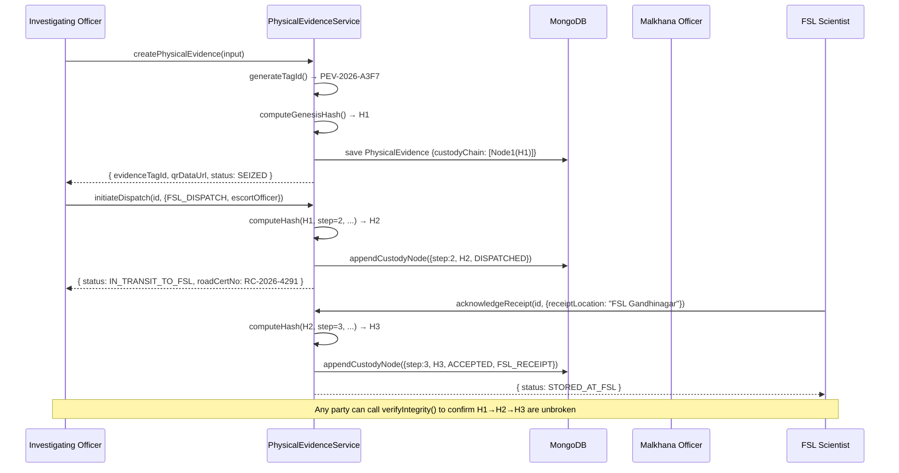
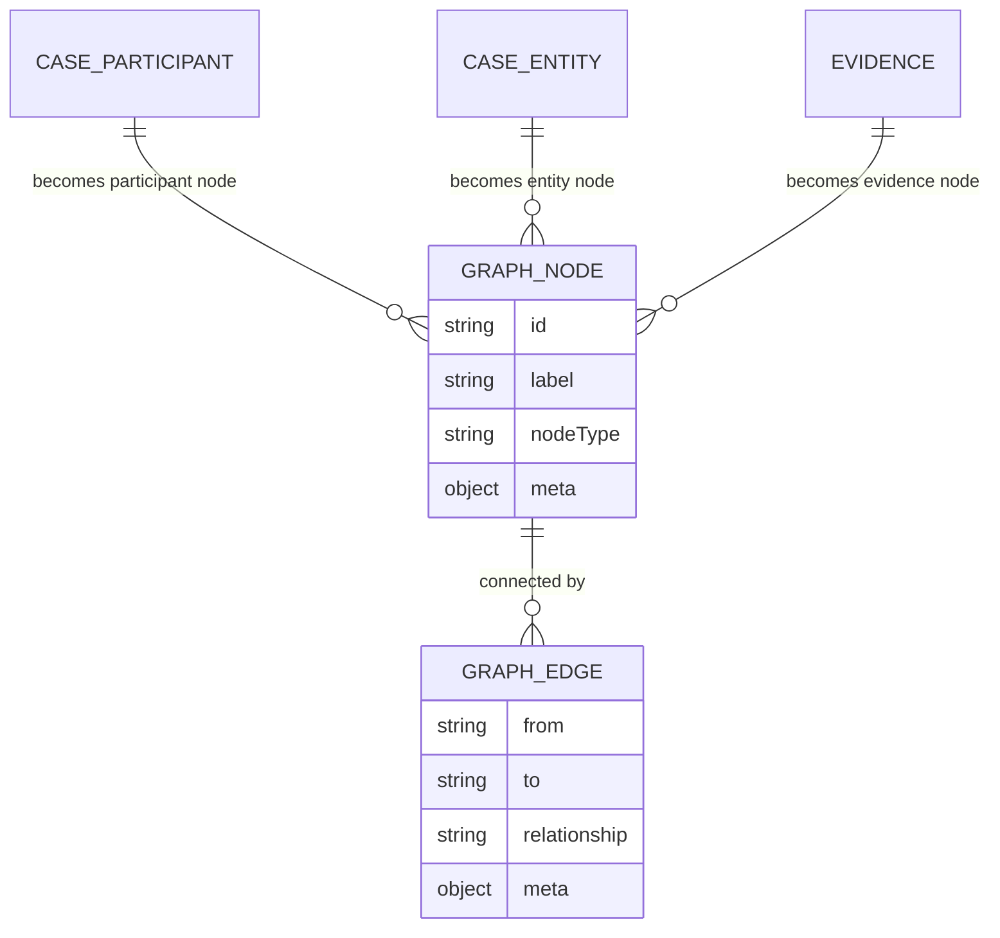
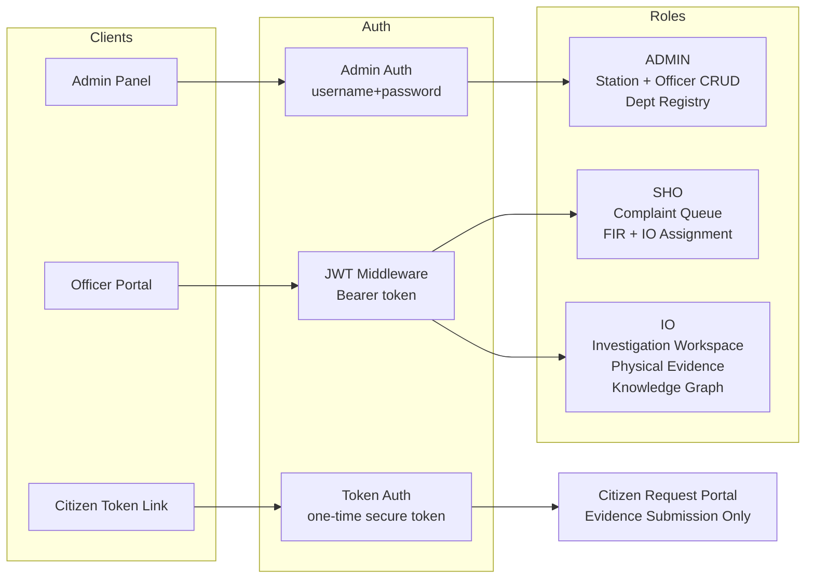
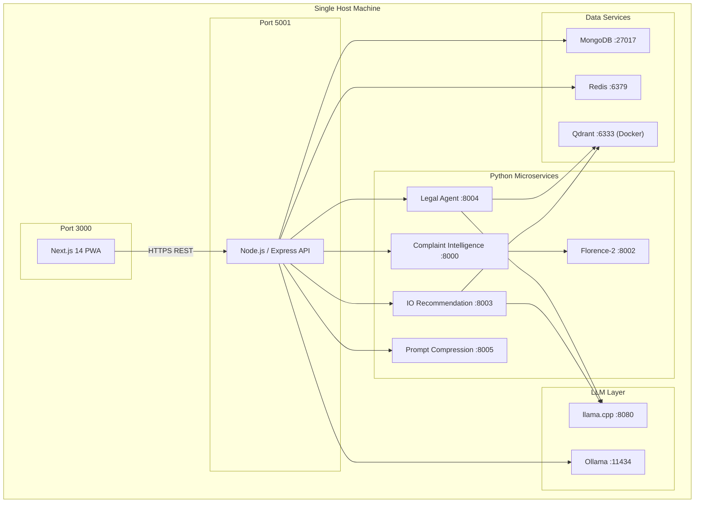

# Crime OS — System Architecture

> Technical reference for the Crime OS platform architecture — covering system design, component responsibilities, data flows, inter-service communication, security model, and deployment topology.

For a functional overview of the platform and user workflows, see [README.md](./README.md).

---

## Table of Contents

1. [Architecture Diagram](#1-architecture-diagram)
2. [Component Responsibilities](#2-component-responsibilities)
3. [Major Data & Request Flows](#3-major-data--request-flows)
   - [Flow 1 — Complaint Filing → Evidence Processing → AI Analysis](#flow-1--complaint-filing--evidence-processing--ai-analysis)
   - [Flow 2 — Copilot Query (ASK & AGENT mode)](#flow-2--copilot-query-ask--agent-mode)
   - [Flow 3 — Department Request → Email → Reply → Case Update](#flow-3--department-request--email--reply--case-update)
   - [Flow 4 — Case Closure → Vector Embedding → IO Recommendation](#flow-4--case-closure--vector-embedding--io-recommendation)
   - [Flow 5 — Evidence Upload → Deepfake Detection → Confidence Score](#flow-5--evidence-upload--deepfake-detection--confidence-score)
   - [Flow 6 — Offline Mutation Outbox → Auto-Sync (PWA)](#flow-6--offline-mutation-outbox--auto-sync-pwa)
   - [Flow 7 — Physical Evidence Custody Chain](#flow-7--physical-evidence-custody-chain)
   - [Flow 8 — Knowledge Graph AI Enrichment](#flow-8--knowledge-graph-ai-enrichment)
4. [Component Communication](#4-component-communication)
5. [Security & Access Architecture](#5-security--access-architecture)
6. [Deployment Architecture](#6-deployment-architecture)
7. [Project Folder Structure](#7-project-folder-structure)

---

## 1. Architecture Diagram

The diagram below shows the complete system — every service, every data store, and every major data flow.

```mermaid
flowchart TD
    %% ── Styling ──────────────────────────────────────────────────────────────
    classDef ui        fill:#1e3a5f,stroke:#4a90d9,color:#e8f4fd,rx:6
    classDef api       fill:#1a3a2a,stroke:#4caf7d,color:#e8f5e9,rx:6
    classDef db        fill:#3a1f00,stroke:#ff9800,color:#fff3e0,rx:6
    classDef pyservice fill:#2d1b4e,stroke:#9c64dd,color:#f3e5f5,rx:6
    classDef llm       fill:#3b1f1f,stroke:#ef5350,color:#ffebee,rx:6
    classDef queue     fill:#1a2a3a,stroke:#64b5f6,color:#e3f2fd,rx:6
    classDef external  fill:#2a2a2a,stroke:#aaaaaa,color:#f5f5f5,rx:6
    classDef pwa       fill:#0d3b2e,stroke:#00bfa5,color:#e0f7fa,rx:6
    classDef phys      fill:#2a1a00,stroke:#ffa726,color:#fff8e1,rx:6

    %% ══════════════════════════════════════════════════════════════════════════
    %% BROWSER LAYER
    %% ══════════════════════════════════════════════════════════════════════════
    subgraph BROWSER["🖥️  Browser — Next.js 14 Frontend (PWA)"]
        direction LR
        UI_SHO["SHO Portal"]:::ui
        UI_IO["IO Investigation\nWorkspace"]:::ui
        UI_ADMIN["Admin Panel"]:::ui
        UI_CORKBOARD["Case Corkboard\n(Knowledge Graph Viz)"]:::ui
        PWA_CACHE["PWA / Service Worker\n@ducanh2912/next-pwa\nIndexedDB (Dexie.js)\nOutbox + LRU Case Cache"]:::pwa
    end

    %% ══════════════════════════════════════════════════════════════════════════
    %% BACKEND API
    %% ══════════════════════════════════════════════════════════════════════════
    subgraph BACKEND["⚙️  Node.js / Express Backend API  (TypeScript)"]
        direction TB
        API_AUTH["Auth & JWT\nMiddleware"]:::api
        API_COMPLAINT["Complaint\nRoutes"]:::api
        API_INVEST["Investigation\nRoutes"]:::api
        API_FIR["FIR\nService"]:::api
        API_CHARGE["Charge Sheet\nGenerator"]:::api
        API_DEPT_REQ["Department\nRequest Service"]:::api
        API_ANALYSIS["Investigation\nOrchestrator"]:::api
        API_COPILOT["Copilot\nService"]:::api
        API_DIARY["Case Diary\nService"]:::api
        API_TRANSLATE["Translation\nService"]:::api
        API_IO_REC["IO Recommendation\nClient"]:::api
        API_ROOM["Case Room\nService (Socket.io)"]:::api
        API_ENCRYPT["AES-256-GCM\nEncryption Util"]:::api
        API_DEEPFAKE["SightEngine\nDeepfake Client"]:::api
        API_COMPRESS["Prompt Compression\nClient"]:::api
        API_PHYS["Physical Evidence\nService + Routes"]:::phys
        API_GRAPH["CaseGraphService\nbuildGraph()"]:::api
        SSE["SSE — Real-time\nAnalysis Progress"]:::api
    end

    %% ══════════════════════════════════════════════════════════════════════════
    %% DATA LAYER
    %% ══════════════════════════════════════════════════════════════════════════
    subgraph DATA["🗄️  Data Layer"]
        MONGO[("MongoDB\n— Complaints\n— Evidence (AES encrypted)\n— Participants\n— Diary\n— FIRs\n— Charge Sheets\n— Requests\n— CaseRoomMessages (AES)\n— PhysicalEvidence\n— CaseEntity")]:::db
        REDIS[("Redis\n— Session Cache\n— Translation Cache\n— SSE Pub/Sub\n— Job State")]:::db
        CLOUDINARY[("Cloudinary CDN\n— Evidence Files\n— FIR PDFs (watermarked)\n— Diary PDFs (watermarked)\n— Charge Sheet PDFs\n— Physical Evidence Photos")]:::external
    end

    %% ══════════════════════════════════════════════════════════════════════════
    %% QUEUES
    %% ══════════════════════════════════════════════════════════════════════════
    subgraph QUEUES["📬  BullMQ Background Queues  (Redis-backed)"]
        Q_EMAIL["Email Queue\n(Gmail OAuth2 / Nodemailer)"]:::queue
        Q_DIARY["Case Diary PDF\nQueue"]:::queue
        Q_EVIDENCE["Evidence\nProcessing Queue"]:::queue
    end

    %% ══════════════════════════════════════════════════════════════════════════
    %% PYTHON AI SERVICES
    %% ══════════════════════════════════════════════════════════════════════════
    subgraph PYTHON["🐍  Python FastAPI Microservices"]
        direction TB

        subgraph CI["Complaint Intelligence  :8000"]
            CI_PDF["PDF Worker\nPyMuPDF → text\nFallback → Florence OCR"]:::pyservice
            CI_IMG["Image Worker\nFlorence-2 caption\n+ PaddleOCR 2.7.3"]:::pyservice
            CI_AUD["Audio Worker\nfaster-whisper (tiny)\nVAD + auto-translate"]:::pyservice
            CI_VID["Video Worker\nscenedetect + moviepy\nKeyframes → Florence"]:::pyservice
            CI_NER["NER\nspaCy en_core_web_sm"]:::pyservice
        end

        FLORENCE["Florence-2 Service  :8002\nmicrosoft/Florence-2-base\n(CPU/CUDA, resident in memory)"]:::pyservice

        subgraph LA["Legal Agent  :8004"]
            LA_BM25["BM25 Search\n(keyword, schema-weighted)"]:::pyservice
            LA_VEC["Vector Search\n(Qdrant cosine)"]:::pyservice
            LA_FUSE["Weighted RRF Fusion\nBM25×0.4 + Vector×0.6"]:::pyservice
            LA_RERANK["ONNX Cross-Encoder\nReranker"]:::pyservice
            LA_OUT["Top 5 Legal\nContext Sections"]:::pyservice
        end

        IOREC["IO Recommendation  :8003\nnomic-embed-text-v2-moe Q4_K_M\n(llama.cpp) + Qdrant\nWeighted Voting Algorithm"]:::pyservice

        PROMPT_COMPRESS["Prompt Compression  :8005\nLLMLingua-2 (BERT-base)\nmicrosoft/llmlingua-2-bert-base\n-multilingual-cased-meetingbank\n~110 MB, CPU-efficient"]:::pyservice
    end

    %% ══════════════════════════════════════════════════════════════════════════
    %% LLMs
    %% ══════════════════════════════════════════════════════════════════════════
    subgraph LLM_LAYER["🤖  LLM Layer"]
        OLLAMA["Ollama  :11434\ngemma4:e2b\nctx=32 768 tokens\nFast calls: temp=0.3 / 512 tok\nDeep calls: temp=0.1 / 1024 tok"]:::llm
    end

    %% ══════════════════════════════════════════════════════════════════════════
    %% VECTOR DB
    %% ══════════════════════════════════════════════════════════════════════════
    QDRANT[("Qdrant  :6333\n— Legal sections\n  BNS · BNSS · BSA\n  SOPs · Dept Registry\n— Closed case vectors\n  IO Recommendation\n[Scalar Quantization optional]")]:::db

    %% ══════════════════════════════════════════════════════════════════════════
    %% EMBEDDING MODELS
    %% ══════════════════════════════════════════════════════════════════════════
    subgraph EMBED["📐  Embedding Models"]
        BGE["BAAI/bge-base-en-v1.5\n(sentence-transformers)\nLegal Agent — primary"]:::llm
        NOMIC["nomic-embed-text-v2-moe\n(llama.cpp / GGUF Q4_K_M)\nLegal Agent fallback +\nIO Recommendation"]:::llm
    end

    %% ══════════════════════════════════════════════════════════════════════════
    %% EXTERNAL
    %% ══════════════════════════════════════════════════════════════════════════
    GMAIL_POLL["Gmail API\n(OAuth2 Polling)\nDept reply ingestion"]:::external
    DEPT_EMAIL["External Departments\n(Forensic / Medical / Bank\n/ Telecom / Court …)"]:::external
    SIGHTENGINE["SightEngine API\n(deepfake detection\nfor image/audio/video)"]:::external

    %% ══════════════════════════════════════════════════════════════════════════
    %% FLOWS — Browser → Backend
    %% ══════════════════════════════════════════════════════════════════════════
    BROWSER -->|"HTTPS REST + SSE\n+ Socket.io (WS)"| BACKEND
    PWA_CACHE -.->|"offline fallback\n(IndexedDB hit)"| UI_IO
    PWA_CACHE -.->|"outbox replay\non reconnect"| BACKEND
    BACKEND --> API_AUTH
    API_AUTH --> API_COMPLAINT & API_INVEST & API_FIR & API_CHARGE & API_DEPT_REQ

    %% Backend → Data
    BACKEND <-->|"read / write"| MONGO
    BACKEND <-->|"cache / pub-sub"| REDIS
    BACKEND -->|"signed URL\nupload & fetch"| CLOUDINARY

    %% Physical Evidence
    API_PHYS <-->|"CRUD + custody chain"| MONGO
    API_PHYS -->|"item photo upload"| CLOUDINARY
    UI_IO -->|"POST/GET\n/physical-evidence"| API_PHYS

    %% Knowledge Graph
    API_GRAPH -->|"query participants\nentities + evidence"| MONGO
    UI_CORKBOARD -->|"GET /cases/:id/graph"| API_GRAPH
    API_ANALYSIS -->|"buildGraphContextSummary()"| API_GRAPH

    %% Backend → Queues
    API_COMPLAINT -->|"enqueue evidence job"| Q_EVIDENCE
    API_DEPT_REQ  -->|"enqueue email"| Q_EMAIL
    API_DIARY     -->|"enqueue PDF job"| Q_DIARY
    Q_EMAIL       -->|"send via SMTP\nor Gmail OAuth2"| GMAIL_POLL
    GMAIL_POLL    <-->|"send / poll replies"| DEPT_EMAIL

    %% Backend → Python services
    API_ANALYSIS  -->|"POST /analyze"| CI
    API_COPILOT   -->|"POST /copilot"| LA
    API_ANALYSIS  -->|"POST /copilot"| LA
    API_TRANSLATE -->|"POST /translate\n(page text blocks)"| OLLAMA
    API_IO_REC    -->|"POST /recommend-officers"| IOREC
    API_COMPRESS  -->|"POST /compress\n(before LLM calls)"| PROMPT_COMPRESS

    %% Deepfake detection flow
    Q_EVIDENCE    -->|"evidence processed\ntrigger deepfake check"| API_DEEPFAKE
    API_DEEPFAKE  -->|"models=deepfake\nPOST check.json"| SIGHTENGINE
    API_DEEPFAKE  -->|"confidence_score\nwritten back"| MONGO

    %% Encryption flows
    API_ENCRYPT   -->|"encrypt before save"| MONGO
    API_ROOM      -->|"AES-encrypted\nmessages"| MONGO

    %% Orchestrator → LLM
    API_ANALYSIS  -->|"fast + deep\ngenerate calls"| OLLAMA
    API_FIR       -->|"bilingual FIR\nnarrative"| OLLAMA
    API_DIARY     -->|"Roznamcha\ndraft"| OLLAMA
    API_CHARGE    -->|"deep narrative\ngeneration"| OLLAMA

    %% Evidence pipeline (queue → CI service)
    Q_EVIDENCE    -->|"process evidence"| CI
    CI_PDF        -->|"scanned pages\nrouted to"| FLORENCE
    CI_IMG        -->|"image captioning"| FLORENCE
    CI_VID        -->|"keyframes\ncaptioning"| FLORENCE

    %% Legal Agent internal flow
    LA_BM25 --> LA_FUSE
    LA_VEC  --> LA_FUSE
    LA_FUSE --> LA_RERANK --> LA_OUT

    %% Legal Agent → Qdrant & Embeddings
    LA_VEC  -->|"vector search"| QDRANT
    BGE     -->|"embed query\n(primary)"| LA_VEC
    NOMIC   -.->|"embed query\n(fallback)"| LA_VEC

    %% IO Recommendation → Qdrant & Embeddings
    IOREC   <-->|"upsert closed case\n+ similarity search"| QDRANT
    NOMIC   -->|"embed complaint\n+ embed closed case"| IOREC

    %% SSE flow
    REDIS   -->|"analysis progress\nevents"| SSE
    SSE     -->|"real-time stream"| UI_IO

    %% PDF upload → CDN
    Q_DIARY  -->|"upload diary PDF\n(watermarked)"| CLOUDINARY
    API_FIR  -->|"upload FIR PDFs\n(EN + GUJ-EN, watermarked)"| CLOUDINARY
    API_CHARGE -->|"stream charge\nsheet PDF"| BROWSER
```



---

## 2. Component Responsibilities

A plain-language breakdown of what each layer in the architecture is responsible for.

**Frontend (Next.js 14 — PWA)**
The browser-side application. Renders all four portals — SHO, IO Investigation Workspace, Admin, and Case Corkboard — as a single Next.js app using the App Router. Communicates with the backend exclusively over HTTPS REST, Server-Sent Events (SSE), and Socket.io WebSocket (for the Private Case Room). Deployed as a **Progressive Web App (PWA)** using `@ducanh2912/next-pwa`, enabling installation on any device and full offline-first capability. The offline layer (`frontend/src/lib/offline/`) uses **Dexie.js** (IndexedDB) to cache up to 5 cases per officer (LRU eviction) and an **Outbox Manager** to queue mutations while disconnected. On reconnect, queued operations are replayed in dependency order with up to 3 retries and exponential backoff. Conflict resolution uses Last-Write-Wins at the field level.

**Backend API (Node.js / Express, TypeScript)**
The central coordination layer. All business logic lives here — complaint management, investigation orchestration, FIR generation, charge sheet assembly, case diary, department requests, PDF generation, the Private Case Room, Physical Evidence custody chain management, and the Knowledge Graph assembly. It is the only component that talks directly to MongoDB and Redis, and the only entry point for the frontend. Delegates all AI and ML work to the Python microservices over HTTP. PDF generation (FIR, diary, charge sheet) uses **PDFKit** with a centered SVG organization logo watermark (15% opacity, 65% of page width) on every page.

**Physical Evidence Service (`PhysicalEvidenceService.ts`)**
Manages the full lifecycle of physically seized items — weapons, narcotics, vehicles, documents, biological samples, and electronic devices. Generates a unique `evidenceTagId` (e.g. `PEV-2026-00491`) and a QR code (pointing to a public verification URL) for every item. Computes and verifies a **SHA-256 cryptographic custody chain** — each transfer appends a new `CustodyNode` whose `currentHash` is computed from the previous hash plus all transfer parameters, forming a blockchain-like tamper-proof chain. The `verifyIntegrity()` method re-computes every hash in the chain and flags the exact step where any tampering occurred.

**CaseGraphService (`caseGraphService.ts`)**
Dynamically assembles the **Knowledge Graph** for any case on demand — no pre-built graph is stored. Queries `CaseParticipant`, `CaseEntity`, and `Evidence` collections in parallel, then creates typed nodes and infers edges across four relationship types: `corroborates` (entity → evidence), `evidence_of` (evidence → participant), `shared_identifier` (participant ↔ participant with matching identifier values), and `participant_entity` (participant → entity with matching value). The `buildGraphContextSummary()` method extracts high-signal insights — shared identifiers between participants and multi-corroborated entities — and injects them into the LLM's analysis prompt.

**AES-256-GCM Encryption Utility (`encryption.util.ts`)**
Shared backend utility that encrypts and decrypts arbitrary values using AES-256-GCM. Each call generates a unique random IV and returns the format `enc:<iv_hex>:<ciphertext_hex>:<authTag_hex>`. The key is loaded from the `ENCRYPTION_KEY` environment variable (32 bytes). Used in two places: (1) the **Evidence Encryption Plugin** that transparently encrypts 16 sensitive evidence fields at rest, and (2) the **CaseRoomService** that encrypts every chatroom message before MongoDB persistence.

**Evidence Encryption Plugin (`evidenceEncryption.plugin.ts`)**
A Mongoose schema plugin applied to the `Evidence` collection. Hooks into `pre('save')`, `pre('updateOne')`, `pre('findOneAndUpdate')`, and `pre('updateMany')` to encrypt sensitive fields before they reach MongoDB, and `post('find')`, `post('findOne')`, `post('save')` to decrypt them transparently before the data is returned to the application layer. No application code needs to be aware of the encryption — it is entirely transparent.

**MongoDB**
The primary data store. Holds every persistent entity: complaints, evidence records (with AES-encrypted sensitive fields), case participants, analysis snapshots, diary entries, FIRs, charge sheets, department request threads, private chatroom messages (AES-encrypted), officer accounts, station data, physical evidence records (with cryptographic custody chains), and case entities. All relationships between entities are stored here.

**Redis**
Used for two purposes: short-lived caching (sessions, translated page text, analysis job state) and real-time pub/sub messaging (publishing analysis progress events that are forwarded to the browser as SSE streams).

**BullMQ Queues (Redis-backed)**
Three independent job queues handle work that must happen in the background without blocking an API response: evidence processing, email dispatch, and case diary PDF generation. Workers pick up jobs from these queues and process them asynchronously.

**Cloudinary CDN**
Cloud storage for all binary files — uploaded evidence (images, audio, video, documents), generated PDFs (FIR, case diary, charge sheet), and physical evidence item photographs. The backend generates a signed upload URL and sends it to the client; the browser uploads directly to Cloudinary without the file ever touching the backend server.

**SightEngine Deepfake Detection Service**
External REST API (`https://api.sightengine.com/1.0/check.json`) called by the **SightEngineService** in the backend after evidence is processed. Accepts the Cloudinary URL of an uploaded file and returns a deepfake probability score. The backend normalizes this to a 0–100 `confidence_score` stored on the evidence document. Scores ≥ 70 trigger a warning badge in the Investigation Workspace. Enabled/disabled via `SIGHTENGINE_ENABLE_DEEPFAKE_CHECK`; fails silently with a score of 0 if unavailable.

**Private Case Room (Socket.io)**
Real-time bidirectional communication between IOs assigned to the same case. The backend attaches a Socket.io server to the Express HTTP server. The frontend connects via `socket.io-client`. JWT authentication is validated on every connection. The namespace `/case-room` is used; clients join a room keyed by `case_id`. All messages are AES-256-GCM encrypted by `CaseRoomService` before persistence. Room eligibility (minimum 2 assigned IOs) is enforced at both the REST eligibility endpoint and the Socket.io join handler.

**Complaint Intelligence Service (Python FastAPI)**
Processes every evidence file. Routes each file type to the appropriate worker: PDFs to PyMuPDF, images to Florence-2 + PaddleOCR, audio to Whisper, video to scenedetect + moviepy + Florence. After processing, it runs spaCy NER across all extracted text and writes the enriched metadata back to MongoDB via the backend. After the pipeline completes, the backend triggers the **SightEngine deepfake check** for image, audio, and video files.

**Florence-2 Service (Python FastAPI)**
A dedicated REST wrapper around `microsoft/Florence-2-base`. Kept resident in memory to avoid repeated cold-start costs. Called internally by the Complaint Intelligence service for image captioning and OCR on scanned documents.

**Legal Agent Service (Python FastAPI)**
The RAG retrieval engine for all legal lookups. Maintains a hybrid BM25 + vector index over BNS, BNSS, BSA, SOPs, and the Department Registry. Returns the top 5 most relevant legal context sections for any query. Called by the backend during AI analysis and Copilot requests.

**IO Recommendation Service (Python FastAPI)**
Stores vector embeddings of every closed case in Qdrant. When a new case needs to be assigned, it finds the most similar historical cases and ranks the available IOs by how often they handled comparable work.

**Prompt Compression Service (Python FastAPI, port 8005)**
A standalone LLMLingua-2 compression service that reduces the token count of prompts before they are sent to the LLM. Uses `microsoft/llmlingua-2-bert-base-multilingual-cased-meetingbank` (~110 MB BERT model, CPU-efficient). The model is lazy-loaded on the first request and cached in-process via `lru_cache`. The backend's `promptCompressionClient.ts` calls this service before every major LLM interaction (case analysis, Copilot agent mode, department request drafts, charge sheet narratives). Graceful fallback: if the service is unavailable or times out (60s), the original uncompressed text is passed to the LLM with a warning log. Enabled/disabled via `PROMPT_COMPRESSION_ENABLED`.

**Ollama (gemma4:e2b)**
The local LLM server. All text generation — analysis narratives, department letters, charge sheet sections, Copilot responses, diary drafts, translations — is served from here. Runs on the same machine as the backend.

**Qdrant (with optional Scalar Quantization)**
The vector database. Two collections in use: one for the Legal Agent (legal sections + SOPs + Department Registry embeddings) and one for the IO Recommendation service (closed case embeddings). Queried via cosine similarity search. **Scalar Quantization** is optionally enabled per collection to reduce the memory footprint by ~75% (32-bit floats → 8-bit integers) with minimal impact on retrieval accuracy.

---

## 3. Major Data & Request Flows

### Flow 1 — Complaint Filing → Evidence Processing → AI Analysis

```
Officer submits complaint (with evidence files)
  │
  ├─► Backend saves complaint to MongoDB (status: SUBMITTED)
  │
  ├─► Backend enqueues evidence processing job → Evidence Queue (BullMQ)
  │     └─► Evidence Worker picks up job
  │           ├─► PDF pages  → PyMuPDF (text) / Florence-2 (scanned pages)
  │           ├─► Images     → Florence-2 caption + PaddleOCR text
  │           ├─► Audio      → faster-whisper transcription + translation
  │           ├─► Video      → scenedetect keyframes → Florence-2 + Whisper
  │           └─► All text   → spaCy NER (people, places, orgs, dates)
  │                 └─► AI metadata written back to Evidence in MongoDB
  │
  └─► Backend triggers Investigation Orchestrator (async)
        ├─► Assembles all case facts from MongoDB
        ├─► CaseGraphService.buildGraphContextSummary() → high-signal graph insights
        ├─► Calls Legal Agent RAG → top 5 BNS/BNSS/BSA sections
        ├─► Calculates Confidence Score (evidence coverage + checklist progress)
        ├─► Calls Ollama gemma4:e2b (fast pass) → quick narrative
        ├─► Calls Ollama gemma4:e2b (deep pass, JSON mode) → full analysis snapshot
        │     (participants, legal sections, next steps, suspect candidates)
        ├─► Saves AnalysisSnapshot to MongoDB
        └─► Publishes progress events to Redis → SSE → IO browser (live progress bar)
```

### Flow 2 — Copilot Query (ASK & AGENT mode)

```
IO types a question or instruction into the Copilot
  │
  ├─► Backend receives query + current case ID
  │
  ├─► [Both modes] Calls Legal Agent Service
  │     ├─► BM25 keyword search over legal corpus
  │     ├─► Vector search in Qdrant (BGE/Nomic embeddings)
  │     ├─► Weighted RRF fusion (BM25×0.4 + Vector×0.6)
  │     ├─► ONNX reranker → top 5 context sections
  │     └─► Returns legal chunks + citations
  │
  ├─► [ASK mode] Backend calls Ollama (fast call)
  │     Input: question + retrieved legal context + case summary
  │     Output: direct answer → streamed back to browser
  │
  └─► [AGENT mode] Backend fetches complete case state from MongoDB
        ├─► Combines: full case facts + legal context + IO's instruction
        ├─► Calls Ollama (deep call, JSON mode)
        │     Output: updated analysis proposals (new participants,
        │             revised sections, new checklist steps, request drafts)
        ├─► Saves new AnalysisSnapshot (linked to parent via parent_snapshot_id)
        └─► Returns structured proposal cards to browser for IO review
```

### Flow 3 — Department Request → Email → Reply → Case Update

```
IO requests information from an external department
  │
  ├─► IO selects checklist step + department entity
  │
  ├─► Backend calls Ollama (deep call) → drafts formal letter
  │     (correct BNSS citations, specific data requested, deadline, IO sign-off)
  │
  ├─► IO reviews draft → clicks Send
  │
  ├─► Backend enqueues email job → Email Queue (BullMQ)
  │     └─► Email Worker dispatches via Gmail OAuth2 to department contact
  │
  ├─► Department receives email → logs into Department Portal
  │     ├─► Reads request thread
  │     ├─► Types response (optionally clicks "Format with AI" → Ollama rewrites it)
  │     └─► Submits response (optional file attachment)
  │
  └─► [Continuous polling — every 60 seconds]
        Gmail API polls for replies to the police inbox
          ├─► Incoming reply matched to open RequestThread by subject/thread ID
          ├─► Reply content saved as new message in RequestThread (MongoDB)
          ├─► Attachment (if any) saved as Evidence record
          ├─► Corresponding checklist step marked complete
          └─► Investigation Orchestrator re-triggered → fresh analysis snapshot
```

### Flow 4 — Case Closure → Vector Embedding → IO Recommendation

```
IO closes the investigation
  │
  ├─► Backend updates complaint status → CLOSED in MongoDB
  │
  ├─► Backend assembles case summary text
  │     (category, location, descriptions, participants, outcomes)
  │
  ├─► Backend calls IO Recommendation Service (fire-and-forget)
  │     ├─► Service embeds case text via nomic-embed-text-v2-moe (llama.cpp)
  │     └─► Vector upserted into Qdrant collection (keyed by FIR ID + officer ID)
  │
  └─► [On next IO assignment]
        SHO opens Assign IO screen
          ├─► Backend calls IO Recommendation Service
          │     ├─► New complaint embedded via nomic-embed-text-v2-moe
          │     ├─► Qdrant similarity search → top 50 similar closed cases
          │     │     (filtered by same station)
          │     ├─► Weighted voting: similarity scores accumulated per officer
          │     └─► Officers returned ranked 0–100 with reasons + match count
          └─► SHO sees ranked IO list → selects and assigns
```

### Flow 5 — Evidence Upload → Deepfake Detection → Confidence Score

```
Evidence file uploaded by officer (image / audio / video)
  │
  ├─► Browser uploads directly to Cloudinary (signed URL)
  ├─► Backend creates Evidence record (processingStatus: PENDING)
  ├─► Backend enqueues evidence processing job → Evidence Queue
  │
  └─► Evidence Worker picks up job (Complaint Intelligence Service)
        ├─► [Standard pipeline] OCR / transcription / captioning / NER
        ├─► AI metadata written back to Evidence in MongoDB
        │
        └─► Backend calls SightEngineService.evaluateConfidence()
              ├─► Checks SIGHTENGINE_ENABLE_DEEPFAKE_CHECK flag
              ├─► POST https://api.sightengine.com/1.0/check.json
              │     params: api_user, api_secret, models="deepfake", url=<cloudinary_url>
              ├─► Receives deepfake probability (0.0–1.0)
              ├─► Normalizes to 0–100 integer → confidence_score
              │     0–30  = Likely Real
              │     30–70 = Uncertain (manual review recommended)
              │     70–100= Likely AI-Generated/Manipulated
              ├─► Updates Evidence.confidence_score in MongoDB
              └─► If score ≥ 70: warning badge shown in Investigation Workspace
```

### Flow 6 — Offline Mutation Outbox → Auto-Sync (PWA)

```
Officer loses internet connection while working on a case
  │
  ├─► UI detects network loss → shows Offline Banner
  ├─► SyncStatus indicator in navbar turns red ("Pending")
  │
  ├─► [While offline] Officer continues working:
  │     ├─► Updates participant statements, case notes, checklist steps
  │     ├─► Each mutation call (PATCH/POST) fails on network layer
  │     └─► offlineApiClient.ts intercepts the failure
  │           ├─► Reads cached case data from IndexedDB (Dexie.js)
  │           ├─► Returns optimistic response to the UI
  │           └─► Queues mutation in OutboxManager (persisted in IndexedDB)
  │
  ├─► [Case data access] On any GET call:
  │     └─► offlineApiClient.ts → network fails → returns CaseCacheManager.getCase()
  │           (LRU cache of up to 5 cases per officer, keyed by case_id + role)
  │           Cache includes: analysis, checklist, diary, evidence, participants,
  │                           threads, room messages, graph data, departments
  │
  └─► [Reconnect] Browser's navigator.onLine fires
        ├─► SyncManager detects reconnection
        ├─► OutboxManager.getPendingOperations() → ordered by dependency chain
        ├─► Operations replayed sequentially:
        │     ├─► Success: removed from outbox, UI updated
        │     └─► Failure: retry_count++ (max 3), exponential backoff
        │           After 3 failures: status → "failed", manual retry available
        ├─► CaseCacheManager updated with fresh server data
        └─► SyncStatus indicator turns green ("Synced")
```

### Flow 7 — Physical Evidence Custody Chain

```
Officer seizes physical item (Weapon, Narcotics, Vehicle, etc.)
  │
  ├─► Officer registers item in system via Physical Evidence form
  │     Body: itemName, category, description, seizureMemoNo,
  │           seizureLocation, sealNumber, conditionOnSeizure, etc.
  │
  ├─► PhysicalEvidenceService.createPhysicalEvidence()
  │     ├─► Generates unique evidenceTagId: PEV-{YEAR}-{HEX6}
  │     ├─► Generates QR code (points to /verify-custody/{tagId})
  │     ├─► Computes Genesis Hash (Step 1):
  │     │     SHA-256("0000...0|1|INITIAL_SEIZURE|officerId|officerName|
  │     │              station|seizureDate|sealNo|")
  │     ├─► Creates CustodyNode (step=1, transferStatus=ACCEPTED)
  │     ├─► Uploads item photo to Cloudinary (if provided)
  │     └─► Saves PhysicalEvidence document to MongoDB
  │           status: SEIZED, currentCustodian = seizing officer
  │
  ├─► [Transfer to Malkhana / FSL / Court]
  │     PhysicalEvidenceService.initiateDispatch()
  │       ├─► Validates item is not already IN_TRANSIT
  │       ├─► Computes next hash:
  │       │     SHA-256(prevHash|step|transferAction|fromId|toName|
  │       │              toLocation|timestamp|sealNo|roadCertNo)
  │       ├─► Creates new CustodyNode (transferStatus=DISPATCHED)
  │       ├─► Generates Road Certificate No: RC-{YEAR}-{4-digit}
  │       └─► Updates status → IN_TRANSIT_TO_FSL / IN_TRANSIT_TO_COURT / etc.
  │
  ├─► [Receiving Officer Acknowledges]
  │     PhysicalEvidenceService.acknowledgeReceipt()
  │       ├─► Validates item is IN_TRANSIT
  │       ├─► Infers new transferAction from receipt location
  │       │     (FSL → FSL_RECEIPT, Court → COURT_PRODUCTION, etc.)
  │       ├─► Computes receipt hash
  │       ├─► Creates CustodyNode (transferStatus=ACCEPTED, sealCondition checked)
  │       └─► Updates status → STORED_IN_MALKHANA / STORED_AT_FSL / PRODUCED_IN_COURT
  │
  └─► [Integrity Verification — anytime]
        PhysicalEvidenceService.verifyIntegrity()
          ├─► Re-computes every hash in custodyChain[]
          ├─► Checks previousHash chain continuity
          └─► Returns { isValid: true } or { isValid: false, brokenStep: N, message }
```

Custody chain hash computation visualized:



### Flow 8 — Knowledge Graph AI Enrichment

```
Investigation Orchestrator runs Analysis (or frontend requests graph)
  │
  ├─► CaseGraphService.buildGraph(caseId)
  │     ├─► Parallel queries:
  │     │     CaseParticipant.find({case_id}) → participants[]
  │     │     CaseEntity.find({case_id})      → entities[]
  │     │     Evidence.find({case_id})        → evidenceDocs[]
  │     │
  │     ├─► Build Nodes:
  │     │     participant nodes  → nodeType="participant", meta={roles, identifiers}
  │     │     entity nodes       → nodeType="entity",      meta={entity_type, value}
  │     │     evidence nodes     → nodeType="evidence",    meta={type, status}
  │     │
  │     └─► Infer Edges (4 types):
  │           (a) entity → evidence      : "corroborates"
  │                via entity.corroborating_evidence_ids
  │           (b) evidence → participant  : "evidence_of"
  │                via evidence.relatedParticipantIds
  │           (c) participant ↔ participant : "shared_identifier"
  │                O(n²) match on identifiers[].value
  │           (d) participant → entity   : "participant_entity"
  │                identifier value matches entity.value
  │
  ├─► buildGraphContextSummary() extracts high-signal lines:
  │     "Participant A and B share identifier 'phone:9876543210'"
  │     "Entity phone:9876543210 is corroborated by 3 pieces of evidence"
  │
  └─► Two consumers:
        (1) Orchestrator → injects summary into LLM prompt
              AI recommends suspect links / new checklist steps
        (2) Frontend Corkboard → receives {nodes[], edges[]}
              Renders interactive node-edge visualization
```

Knowledge Graph node-edge schema:



---

## 4. Component Communication

**Frontend ↔ Backend**
All communication is over HTTPS. Standard REST calls (JSON request/response) handle all data reads, writes, and actions. Analysis progress is delivered as a **Server-Sent Events (SSE)** stream — the browser opens a persistent connection and the backend pushes stage updates as the orchestrator progresses through each step. The **Private Case Room** uses **Socket.io** WebSocket connections for real-time bidirectional messaging between IOs. No polling is needed for chat — messages are pushed instantly. The **Knowledge Graph** is fetched via a single REST call (`GET /api/v1/cases/:id/graph`) that triggers an on-demand in-memory build of the graph. The **PWA offline layer** (`offlineApiClient.ts`) intercepts failed network calls and serves cached responses from IndexedDB, queuing mutations in the outbox for replay when connectivity returns. Graph data (`/graph`) is also included in the offline cache.

**Backend ↔ Python Services**
Synchronous HTTP calls over the local network (all services run on the same host in development). The backend sends a JSON request and awaits the response before continuing. Evidence processing is the exception — it is triggered via the BullMQ queue, so the backend is never blocked waiting for file processing to finish. **Prompt compression** calls are made synchronously just before each LLM prompt is constructed, with a 60-second timeout and automatic fallback to the uncompressed text if the service is slow or unavailable.

**Backend ↔ MongoDB**
All reads and writes go through Mongoose ODM. The backend is the sole writer to MongoDB — no Python service touches the database directly. Python services return their results to the backend over HTTP, and the backend persists them. Sensitive data (evidence fields, chatroom messages) is transparently encrypted before writes and decrypted after reads by Mongoose hooks.

**Backend ↔ Redis**
Two distinct uses: the BullMQ job queues (evidence, email, diary PDF) communicate through Redis as their broker, and the SSE pub/sub channel uses a Redis topic to relay orchestrator progress from the analysis worker to the SSE endpoint that the browser is connected to.

**AI Services ↔ Qdrant**
Both the Legal Agent and the IO Recommendation service communicate directly with Qdrant over HTTP (port 6333). The Legal Agent queries the legal corpus collection. The IO Recommendation service both writes (on case closure) and queries (on IO assignment) the closed-case collection. The backend never talks to Qdrant directly — all vector operations go through the Python services. Qdrant's **Scalar Quantization** can be enabled per collection to reduce memory usage by ~75% at minimal search quality cost.

**Backend ↔ External Services**
Gmail OAuth2 is used bidirectionally: outbound emails are sent via the Gmail API (department request letters), and the backend polls the same Gmail inbox on a configurable interval (default 60 seconds) to ingest department replies. Cloudinary is used for file storage — the backend generates a short-lived signed upload URL, sends it to the browser, and the browser uploads directly. **SightEngine** is called synchronously (with a configurable timeout, default 30 seconds) after evidence is processed to retrieve the deepfake confidence score, which is written back to the Evidence record in MongoDB.

---

## 5. Security & Access Architecture

**Authentication**
All officer sessions are authenticated with **JWT (JSON Web Tokens)**. On login (badge number + password), the backend issues a short-lived access token (15 minutes) and a long-lived refresh token (7 days), both stored as signed HTTP-only cookies. Passwords are hashed with bcrypt. Token secrets are separate per token type (`JWT_ACCESS_SECRET` / `JWT_REFRESH_SECRET`).

**Authorization**
Every protected route passes through a role-check middleware before reaching the handler. The two roles — `SHO` and `IO` — have distinct permission boundaries enforced at the API level:

| Action | SHO | IO |
|---|---|---|
| View station complaint queue | ✓ | — |
| Approve / reject complaints | ✓ | — |
| Register FIR | ✓ | — |
| Assign case to IO | ✓ | — |
| Access Investigation Workspace | ✓ | ✓ (own cases only) |
| Generate charge sheet | ✓ | ✓ |
| Close case | ✓ | ✓ |
| Create / dispatch physical evidence | ✓ | ✓ |
| Acknowledge physical evidence receipt | ✓ | ✓ |
| Verify custody chain integrity | ✓ | ✓ |
| View knowledge graph | ✓ | ✓ |
| Manage officer accounts | — | — (Admin only) |

**Physical Evidence Security**
The cryptographic custody chain prevents silent tampering at the data level. Every `PATCH` to `custodyChain[]` appends a new node whose hash includes the previous hash — any modification to a past node invalidates all subsequent hashes. The `verifyIntegrity` endpoint re-validates the full chain on demand. Physically, the seal number and condition are recorded at every transfer.

**Admin isolation**
The Admin account is a completely separate credential type (username + password, no badge number) and has no access to any investigation data. Admin can only manage officer accounts, stations, and the department registry.

**Data boundaries**
IOs can only access cases assigned to them — the API enforces this on every investigation endpoint. SHOs can access all cases within their station.

**Rate limiting**
API routes are protected with rate limiting (`rate-limiter-flexible`) to prevent abuse.

**File upload security**
Evidence files are never processed by the backend server. The backend issues a Cloudinary signed URL with a short expiry; the browser uploads directly. This eliminates a class of file-handling vulnerabilities on the server.

**Request validation**
All incoming request bodies are validated with Joi schema validators before reaching any business logic.

Role and authentication flow:



---

## 6. Deployment Architecture

All components run as separate processes, co-located on a single host with each service bound to its own port.

| Component | Runtime | Port |
|---|---|---|
| Next.js Frontend (PWA) | Node.js | 3000 |
| Node.js Backend API | Node.js / Express | 5001 |
| Complaint Intelligence Service | Python / Uvicorn | 8000 |
| Florence-2 Service | Python / Uvicorn | 8002 |
| IO Recommendation Service | Python / Uvicorn | 8003 |
| Legal Agent Service | Python / Uvicorn | 8004 |
| Prompt Compression Service | Python / Uvicorn | 8005 |
| Ollama (gemma4:e2b) | Ollama | 11434 |
| llama.cpp server (nomic embeddings) | llama.cpp | 8080 |
| MongoDB | MongoDB | 27017 |
| Redis | Redis | 6379 |
| Qdrant | Qdrant | 6333 |



**`start_all.bat`**
A single batch script at the project root starts all services in the correct order — MongoDB, Redis, Qdrant, Ollama, llama.cpp, each Python FastAPI service, the Node.js backend, and the Next.js frontend — for local development.

---

## 7. Project Folder Structure

```
CRIME_OS/
├── README.md                          # Platform overview, workflows, tech stack
├── Documentation/                     # All documentation files
├── docker-compose.yml                 # Container definitions (Qdrant, etc.)
├── start_all.bat                      # Starts all services for local development
├── requirements.txt                   # Root-level Python deps (shared tooling)
│
├── backend/                           # Node.js / Express API (TypeScript)
│   └── src/
│       ├── app.ts                     # Express app setup, middleware, route registration
│       ├── server.ts                  # HTTP server entry point + Socket.io setup
│       ├── assets/fonts/              # NotoSansGujarati.ttf (embedded in PDFs)
│       ├── config/                    # env.ts, database, redis, bullmq, cloudinary, logger
│       ├── common/
│       │   ├── enums/                 # HTTP status codes
│       │   ├── errors/                # Typed error classes (Auth, Validation, NotFound…)
│       │   └── middlewares/           # authenticate, authorize, errorHandler, rateLimiter,
│       │                              #   requestId, validate
│       ├── modules/
│       │   ├── admin/                 # Officer & station CRUD, department registry
│       │   ├── auth/                  # Login, refresh token, password reset
│       │   ├── caseUnderstanding/     # Case understanding proxy routes
│       │   ├── complaint/             # Complaint filing, status, FIR, evidence
│       │   ├── departmentPortal/      # Department login, inbox, reply endpoints (disabled)
│       │   ├── investigation/
│       │   │   ├── controllers/
│       │   │   │   ├── InvestigationController.ts    # Analysis, copilot, diary, evidence, graph
│       │   │   │   ├── CaseParticipantController.ts
│       │   │   │   ├── CaseRoomController.ts
│       │   │   │   ├── ChargeSheetController.ts
│       │   │   │   ├── CitizenRequestController.ts
│       │   │   │   ├── PhysicalEvidenceController.ts # NEW: Physical evidence CRUD + dispatch
│       │   │   │   └── WarrantController.ts
│       │   │   ├── models/
│       │   │   │   ├── PhysicalEvidence.model.ts     # NEW: Full model with custody chain schema
│       │   │   │   ├── CaseRoomMessage.model.ts      # AES-encrypted chat messages
│       │   │   │   ├── Evidence.model.ts             # deepfake confidence_score, isEncrypted
│       │   │   │   └── [all other models]
│       │   │   ├── plugins/
│       │   │   │   └── evidenceEncryption.plugin.ts  # Mongoose plugin: AES-256-GCM at-rest
│       │   │   ├── routes/
│       │   │   │   ├── investigation.routes.ts       # Includes GET /:id/graph endpoint
│       │   │   │   ├── physicalEvidence.routes.ts    # NEW: /physical-evidence/* routes
│       │   │   │   └── [other route files]
│       │   │   └── services/
│       │   │       ├── caseGraphService.ts           # NEW: buildGraph() + buildGraphContextSummary()
│       │   │       ├── PhysicalEvidenceService.ts    # NEW: SHA-256 custody chain management
│       │   │       ├── investigationOrchestrator.ts  # Uses caseGraphService for AI enrichment
│       │   │       └── [other services]
│       │   ├── police/                # Officer profiles, station data
│       │   ├── translation/           # Translation endpoint (proxies to Ollama)
│       │   └── user/                  # User model & repository
│       └── shared/
│           ├── clients/               # legalAgentClient.ts, ioRecommendationClient.ts,
│           │                          #   promptCompressionClient.ts
│           ├── services/
│           │   └── sightengine/       # SightEngineService: deepfake confidence score
│           └── utils/                 # encryption.util.ts (AES-256-GCM), pdf generators
│
├── frontend/                          # Next.js 14 App Router (TypeScript, PWA)
│   └── src/
│       ├── components/
│       │   └── case/
│       │       └── CaseCorkboard.tsx  # NEW: Interactive Knowledge Graph visualization
│       └── lib/
│           └── offline/               # PWA offline-first layer
│               └── offlineApiClient.ts# Intercepts /graph calls → serves from IndexedDB cache
│
└── services/                          # Python FastAPI microservices
    ├── complaint_intelligence/        # Evidence processing pipeline  (:8000)
    ├── florence_service/              # Florence-2 REST wrapper  (:8002)
    ├── legal_agent/                   # RAG legal retrieval service  (:8004)
    ├── io-recommendation/             # IO recommendation service  (:8003)
    └── prompt_compression/            # LLMLingua-2 compression service  (:8005)
```

---

*Crime OS — Built for Gujarat Police | SVNIT*
